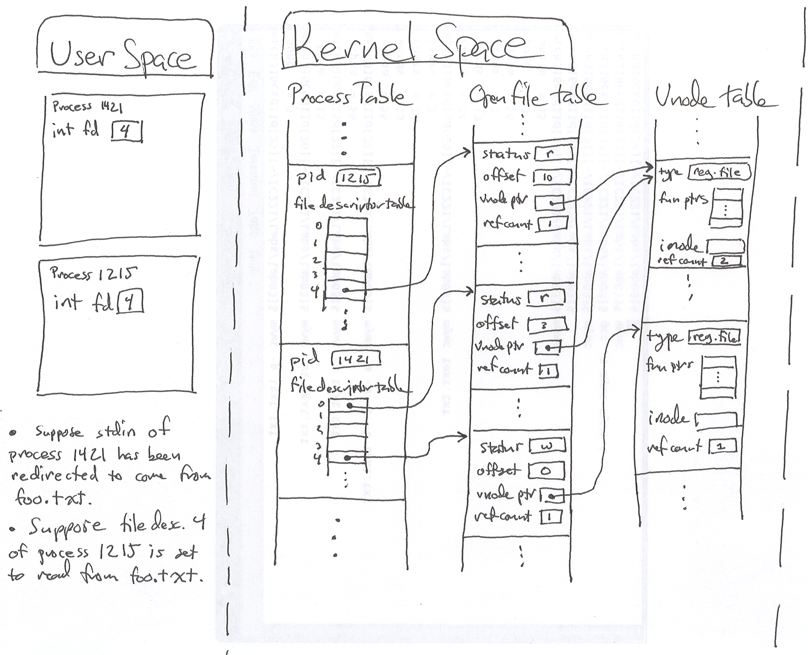
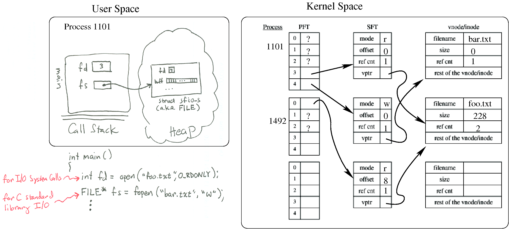

### The process table
    Managing processes is one of the kernel's biggest responsibilities. It decides which process actually gets to run on the CPU (or CPUs) at any point in time. The kernel keeps a data structure (in kernel space) to track information about processes: the process table. Each process has an entry in this table entries are called process control blocks that include all sorts of information. The processes ID (pid) is one piece of info, we'll look at some others shortly. You can actually look at all this process table information by examining files (at least they look like files) in the /proc directory. Try man -s4 proc for more information. And, of course, the ps command gives some info as well. Think of the kernel as a business and the processes as customers. The process table is like the records business keep on clients.

### File I/O
    When a process opens a file and reads or writes, we can identify several entities involved:

        The actual file on the harddrive,
        the kernel's record that stores in memory (i.e. RAM) basic file info - like permissions, location on the harddrive, etc,
        the kernel's record relating to that processes's connection to the file (after all, many processes may be reading fromt he file at the same time, or maybe the same process has several different connections reading from the file simultaneously, but at different locations), and
        the number that the process uses to tell the kernel which file-connection it's trying to read-from/write-to.

    The basic system calls for dealing with file I/O are open, which requests that a connection to a file be made; close, which requests that a connection to a file be closed; read, which requests that some bytes be read from a file via a specified connection; and write, which requests that some bytes be written to a file via a specified connection.

### Unix I/O: file descriptors
    One of the most important resources managed by the kernel is the file system (beware though that in Unix lots of things are part of the file system even if they aren't files in the traditional sense of persistent data stored on a drive).

    The C language (and pretty much any other language is similar) has operating system independent functions for I/O (mostly in stdio.h), like fprintf, fscanf, etc. Their implementations (which we never see) make system calls to get the work done and, of coures, those implementations will be different in Unix vs. Windows vs. PalmOS, etc., because the system calls provided by each OS are different. Soon we'll learn Unix system calls that allow us to make direct requests to the kernel to perform filesystem operations.

    Unix's model of of files is simple: files are just sequences of bytes. User programs may impose structure or meaning on those bytes ... Unix doesn't care.

    A user process and the kernel must agree on names for open file connections. Analogous to the difference between a program and a process, there is a difference between a file and an open "connection" to a file: for example we may have two open connections to the same file, but be in different positions in the file with respect to our next read. So the file name itself isn't really appropriate for communicating which connection you want to read the next byte from. So the OS and the user process refer to each open connection by a number (type int) called a file descriptor. Standard input, output and error default to file descriptors 1, 2 and 3 respectively. You can actually fetch the file descriptor associated with each open C FILE* with the int fileno(FILE* fp); function.

        Remember this ↓   
        file descriptor 0 is a processes' stdin
        file descriptor 1 is a processes' stdout
        file descriptor 2 is a processes' stderr

    The process table entry (aka process control block) contains a table, the file descriptor table that gives the mapping between the descriptor the process uses to refer to a file connection and the data structure inside the kernel that represents the actual file connection.
### System Open File Table
    The system needs to keep track of each "connection" to a file. Since the same file may have many open connections, this "connection" is truly distinct from the concept of a file. Since distinct processes may even share a connections (say two processes wanted to write to the same log file, each adding new data to the end of the file), the "connection" information cannot be kept inside the process table. So the kernel keeps a data structure called the system open-file table which has an entry for each connection. Each entry contains the connection status, e.g. read or write, the current offset in the file, and a pointer to a vnode, which is the OS's structure representing the file, irrespective of where in the file you may currently be looking. (Note: Linux names their vnode-ish data structure "generic inodes".)

### Vnode Table
    The kernel keeps yet another table, the Vnode table, which has an entry for each open file or device. Each entry, called a Vnode, contains information about the type of file and pointers to functions that operate on the file. Typically for files, the vnode also contains a copy of the inode for the file, which has "physical" information about the file, e.g. where exactly on the disk the file's data resides.

### The physical device: inodes, etc.
    Figure 4.13 on p. 106 shows an example of how a file system might be organized on a physical disk. One thing to take away from this is that a file may be broken up into many data blocks, which may be widely distributed across the physical drive. The inode for a file contains the locations of each of the data blocks comprising the file. Directories don't have data blocks, but in a similar fashion have directory blocks, which contain inode/filename pairs; i.e. the names of the files/directories in the directory, along with the inodes for each. Each directory contains entries for "." and ".." --- the current directory and its parent.

### The big picture
    
    	
### Reference counts
    Several file descriptors may actually refer to the same system open-file table entries. That entry in the system open-file table can't be removed until all of those referencing file descriptors have been closed.

    Several system open-file table entries may actually refer to the same vnode table entry. That vnode table entry cannot be removed from the vnode table until all of those referencing system open-file table entries have been removed.

    A file may be referenced by several entries in the filesystem (this comes from "hard links", which you can create with the ln utility) and the file cannot be removed from the filesystem until all of those references to the file have been removed.

    Sensing a pattern? System open-file table entries, vnode table entries, and filesystem entries (inodes actually) each contain a counter (called a reference count) that tracks the number of references to that object. Each time one of the referencing objects goes away or changes to refer to something else, that counter gets dcecremented. When it hits zero, the object itself can be deleted. Reference counting is an important idea and is found in lots of places in CS.

### I/O via the kernel directly versus I/O via the C standard library
    When we do I/O via the C standard library (i.e. with fscanf, fprintf, fopen, fclose), the calls to open, close, read and write don't go away, it's just that the library routines make the calls, rather than our code. In other words, C standard library I/O is just an extra layer. Consider the following diagram, in which a process makes the system call open to read from foo.txt, and the C standard library call fopen to write to bar.txt. Note that the diagram shows another process. What can you say about how the other process was probably created from the shell?

    

