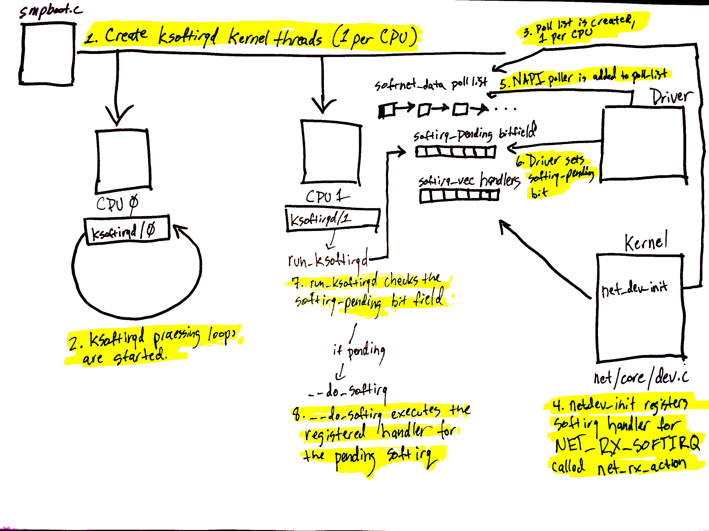

### Sending Data

Overview

For reference, you may want to have a copy of the device data sheet handy. This post will examine the Intel I350 Ethernet controller, controlled by the igb device driver. You can find that data sheet (warning: LARGE PDF) here for your reference.

The high-level path network data takes from a user program to a network device is as follows:

1. Data is written using a system call (like sendto, sendmsg, et. al.).
2. Data passes through the socket subsystem on to the socket’s protocol family’s system (in our case, AF_INET).
3. The protocol family passes data through the protocol layers which (in many cases) arrange the data into packets.
4. The data passes through the routing layer, populating the destination and neighbour caches along the way (if they are cold). This can generate ARP traffic if an ethernet address needs to be looked up.
5. After passing through the protocol layers, packets reach the device agnostic layer.
6. The output queue is chosen using XPS (if enabled) or a hash function.
7. The device driver’s transmit function is called.
8. The data is then passed on to the queue discipline (qdisc) attached to the output device.
9. The qdisc will either transmit the data directly if it can, or queue it up to be sent during the NET_TX softirq.
10. Eventually the data is handed down to the driver from the qdisc.
11. The driver creates the needed DMA mappings so the device can read the data from RAM.
12. The driver signals the device that the data is ready to be transmit.
13. The device fetches the data from RAM and transmits it.
14. Once transmission is complete, the device raises an interrupt to signal transmit completion.
15. The driver’s registered IRQ handler for transmit completion runs. For many devices, this handler simply triggers the NAPI poll loop to start running via the NET_RX softirq.
The poll function runs via a softIRQ and calls down into the driver to unmap DMA regions and free packet data.

### Rx Data

**0. Overview**:

Packet filtering is crucial for securing systems and managing network traffic. Lets look into ‘nftables’ as the replacement for the iptables.

First lets begin with looking at the path a packet takes:

1. Packet first arrives at NIC from the network
2. Packet is then copied to the kernel memory ring buffer via DMA (Direct Memory Access)
3. Hardware interrupt is generated to let system know that the packet is in the memory
4. Device driver then calls into New API (NAPI ) to start poll loop
5. Ksoftirqd then pulls packet out of the ring buffer via NAPI poll function
6. Memory regions that had the packet in the kernel memory ring buffer are unmapped
7. DMA’ed data is passed as a socket buffer (skb) up to the networking layer
8. Packet routing sends it to CPU queues for processing (RPS, RSS can have an affect here)
9. Packets is moved from these queues to the protocol layer (TCP, UDP, etc)
10. Protocol layers move the skb into the buffers attached to specific sockets
11. Application process the packets

**0.1. NAPI**

NAPI (“New API”) is an extension to the device driver packet processing framework, which is designed to improve the performance of high-speed networking. It provides following two key benefits:

    Interrupt Mitigation: High-speed networking can generate thousands of interrupts per second, repeatedly notifying the system about the large number of packets awaiting processing. NAPI mitigates this by allowing drivers to operate with some interrupts disabled during high traffic periods, thereby reducing system load.
    Packet throttling: When the system is overwhelmed and needs to drop packets, it’s more efficient to discard them early in the process. NAPI-compliant drivers can often ensure that packets are dropped directly by the network adapter, preventing them from reaching the kernel.

**0.2. Netfilter & IPTables**

There are frameworks provided by the kernel that allows for networking operations to be implemented via customized handlers. They performs packet filtering, network address translation, and port translation, among other things. They contains set of hooks inside the kernel that allows kernel modules to register callback functions within the networking stack.

Iptables is a userspace program that allows the configuration of netfilter via chains and rules attached to the chains. iptables is for IPv4, ip6tables for IPv6, arptables for ARP, and ebtables for Ethernet fram

**0.3. IP Protocol Layer**

Fundamentally, the IP Protocol layer in the Linux networking stack works to route traffic as necessary — to the right interface when outgoing, or to the right socket when incoming.

**Receiving packet flow:**
When a packet arrives over the medium, the network interface first checks if it is intended for the host computer. If it is, the packet is sent to the IP layer. If the packet is meant for an application, it is passed to the transport layer and placed in a socket to await the application to read it. The IP layer looks up the route to destination. If the destination is another computer, the packet is sent out through an output interface.

1. First the packet arrives at Ingress hook. The ingress hook is attached to a particular network interface. Here we can perform filtering in early stage.
2. Then packet traverse to PREROUTING hook, the packets is intercepted just before the kernel performs any routing decisions. At this stage packet has arrived on a networking interface but has not yet been processed with respect to systems routing table. Most common action that is performed on that hook is destination IP address translation.
3. Now we enter Routing decision phase, the kernel analyzes the destination IP address of incoming packet and matches it to the entries in the routing table. Based on the most specific match or the most suitable route, the kernel will makes the decision to route the packet for local delivery assuming the address is associated with local system or forward the packet to appropriate network interface or gateway if the destination address is on a different network.
4. Assuming its local address the packet will traverse the INPUT hook. It’s main purpose is define the fate of incoming packets destined to our local processes. If allowed traffic will reach local application.

**Sending a packet:**
When an application generates traffic, it sends its packet through a socket to a transport layer (mostly TCP or UDP) and then on to the network layer (IP). Within the IP layer, the kernel determines the route to the destination host by first checking the routing cache and then looking in the Forwarding Information Base (FIB). If the packet destination is another computer, the kernel addresses it and sends it to the link layer, which ultimately sends the packet out to a physical medium.

Lets look it in terms of hooks.
1. First packet hit the routing decision and then goes to OUTPUT hook, at this stage we can filter any locally generated outgoing traffic.
2. Then packet moves to POSTROUTING hook. At this point kernel has made necessary routing decisions. Most common operation at this stage is source address translation, where we replace the source IP of packet with the IP of outgoing interface so the return traffic knows how to get back.
3. Now the packet goes to network interface. If the destination IP is on different network, the routing decision will forward the packet to FORWARD hook. This hook is for packet that are neither locally generated nor destined for local system. The primary purpose of FORWARD hook is to handle packets that are forwarded by system from one network to another. Here filtering can be performed if system is acting as router or gateway.

Summarizing IPTables
- `PREROUTING`: Packets will enter this chain before a routing decision is made
- `INPUT`: The packet is set for local delivery, which is managed by the “local-delivery” routing table and is independent of processes with open sockets:
- `FORWARD`: All packets that have been routed and that were not for local delivery will traverse this chain
- `OUTPUT`: Packets sent from the machine itself will be visiting this chain
- `POSTROUTING`: Packets enter this chain just before handling them off to the hardware. Routing decision has been made.

TCP Stack
- `Sending`: When sending, the application writes into the TCP send buffer, the TCP state machine is updated, goes through the packet processing, and is then passed off to the IP layer.
- `Receiving`: When receiving, after being pushed from the IP layer, the TCP process is scheduled to handle received packets. Each packet goes through a series of processing steps, the TCP state machine is updated, and the packet is stored inside the recv buffer

TCP Tuning

Before we get into nftables it is worth looking at some TCP tuning mechanisms:
- `net.core.rmem_[min/default/max] & net.core.wmem_[min/default/max]` to tweak receive and send buffer sizes for all types of network traffic. (TCP autotuning settings — the first value is the minimum buffer — guaranteed even under system pressure, the second value is the default buffer for each TCP socket, and the third value is the maximum for each TCP socket.)
- Number of packets allowed outstanding = min {congestion window (cwnd), receiver’s advertised window (rwnd)}
- The send buffer holds all outstanding packets, as well as all data queued to be retransmitted. So, Congestion window !> send buffer (the congestion window can never grow larger than the send buffer can accommodate)
- If either of these are too small throughput suffers will suffer and if too large then the amount of outstanding packets can grow large for the end to end and packets will get dropped resulting in packet loss
- `net.ipv4.tcp_rmem & net.ipv4.tcp_wmem`

**Detailed Overview**

The high level path a packet takes from arrival to socket receive buffer is as follows:

1. Driver is loaded and initialized.
2. Packet arrives at the NIC from the network.
3. Packet is copied (via DMA) to a ring buffer in kernel memory.
4. Hardware interrupt is generated to let the system know a packet is in memory.
5. Driver calls into NAPI to start a poll loop if one was not running already.
6. ksoftirqd processes run on each CPU on the system. They are registered at boot time. The ksoftirqd processes pull packets off the ring buffer by calling the NAPI poll function that the device driver registered during initialization.
7. Memory regions in the ring buffer that have had network data written to them are unmapped.
8. Data that was DMA’d into memory is passed up the networking layer as an ‘skb’ for more processing.
9. Incoming network data frames are distributed among multiple CPUs if packet steering is enabled or if the NIC has multiple receive queues.
10. Network data frames are handed to the protocol layers from the queues.
11. Protocol layers process data.
12. Data is added to receive buffers attached to sockets by protocol layers.

#### 1. Initial Setup

The initialization of the softIRQ system is as follows:
1. softIRQ kernel threads are created (one per CPU) in spawn_ksoftirqd in kernel/softirq.c with a call to smpboot_register_percpu_thread from kernel/smpboot.c. As seen in the code, the function run_ksoftirqd is listed as thread_fn, which is the function that will be executed in a loop.
2. The ksoftirqd threads begin executing their processing loops in the run_ksoftirqd function.
3. Next, the softnet_data structures are created, one per CPU. These structures hold references to important data structures for processing network data. One we’ll see again is the poll_list. The poll_list is where NAPI poll worker structures will be added by calls to napi_schedule or other NAPI APIs from device drivers.
net_dev_init then registers the NET_RX_SOFTIRQ softirq with the softirq system by calling open_softirq, as shown here. The handler function that is registered is called net_rx_action. This is the function the softirq kernel threads will execute to process packets.

ONCE network packet rx:

4. The call to napi_schedule in the driver adds the driver's NAPI poll structure to the poll_list for the current CPU.
5. The softirq pending bit is set so that the ksoftirqd process on this CPU knows that there are packets to process.
6. run_ksoftirqd function (which is being run in a loop by the ksoftirq kernel thread) executes.
7. __do_softirq is called which checks the pending bitfield, sees that a softIRQ is pending, and calls the handler registered for the pending softIRQ: net_rx_action which does all the heavy lifting for incoming network data processing.

Steps 5 - 8 on the diagram relate to the arrival of data for processing.

#### 2. Data Arrives

1. Data is received by the NIC from the network.
2. The NIC uses DMA to write the network data to RAM.
3. The NIC raises an IRQ.
4. The device driver’s registered IRQ handler is executed.
5. The IRQ is cleared on the NIC, so that it can generate IRQs for new packet arrivals.
6. NAPI softIRQ poll loop is started with a call to napi_schedule.

The call to napi_schedule triggers the start of steps 5 - 8 in the previous diagram. As we’ll see, the NAPI softIRQ poll loop is started by simply flipping a bit in a bitfield and adding a structure to the poll_list for processing. No other work is done by napi_schedule and this is precisely how a driver defers processing to the softIRQ system.

#### 3. Network data processing begins

1. net_rx_action loop starts by checking the NAPI poll list for NAPI structures.
2. The budget and elapsed time are checked to ensure that the softIRQ will not monopolize CPU time.
3. The registered poll function is called. In this case, the function igb_poll was registered by the igb driver.
4. The driver’s poll function harvests packets from the ring buffer in RAM.
5. Packets are handed over to napi_gro_receive, which will deal with possible Generic Receive Offloading.
6. Packets are either held for GRO and the call chain ends here or packets are passed on to net_receive_skb to proceed up toward the protocol stacks.

Network data processing continues from netif_receive_skb, but the path of the data depends on whether or not Receive Packet Steering (RPS) is enabled or not. An “out of the box” Linux kernel will not have RPS enabled by default and it will need to be explicitly enabled and configured if you want to use it.

#### 4. Protocol stacks and userland sockets

Next up are the protocol stacks, netfilter, berkley packet filters, and finally the userland socket. This code path is long, but linear and relatively straightforward.

1. Packets are received by the IPv4 protocol layer with ip_rcv.
2. Netfilter and a routing optimization are performed.
3. Data destined for the current system is delivered to higher-level protocol layers, like UDP.
4. Packets are received by the UDP protocol layer with udp_rcv and are queued to the receive buffer of a userland socket by udp_queue_rcv_skb and sock_queue_rcv. Prior to queuing to the receive buffer, berkeley packet filters are processed.

### Terms:
- Context switching: switching from
- Syscall: way for programs in usermode to request resources from kernel mode

