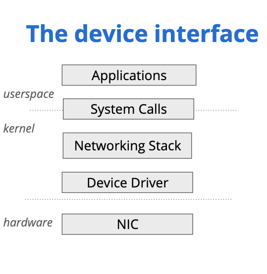
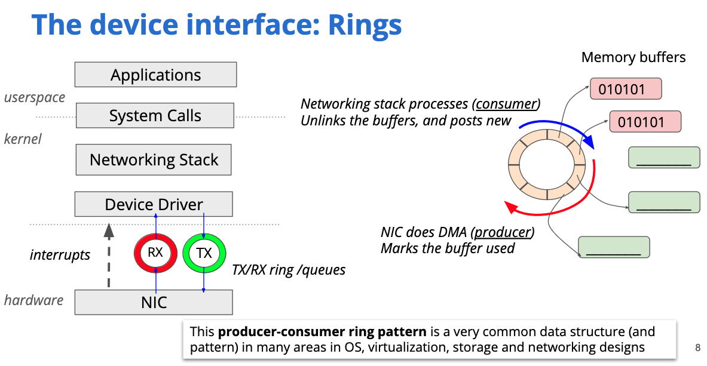
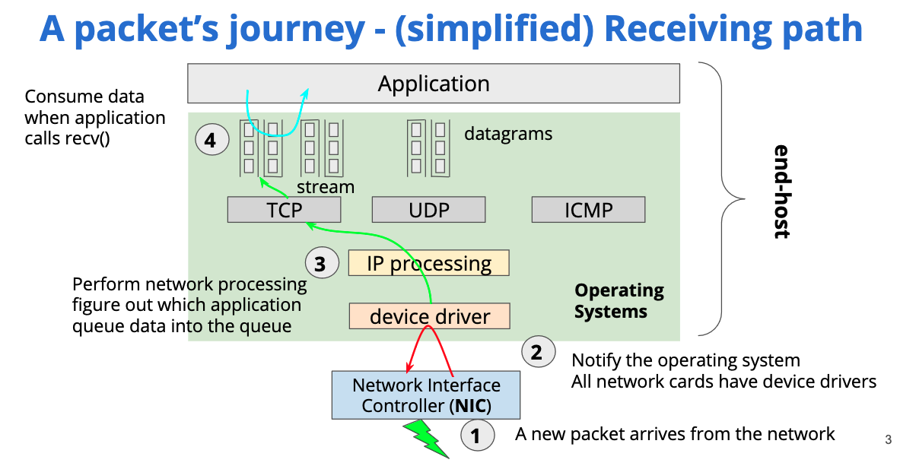
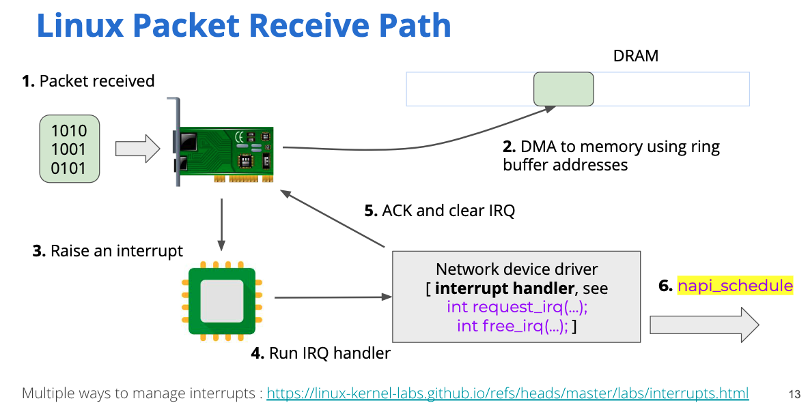
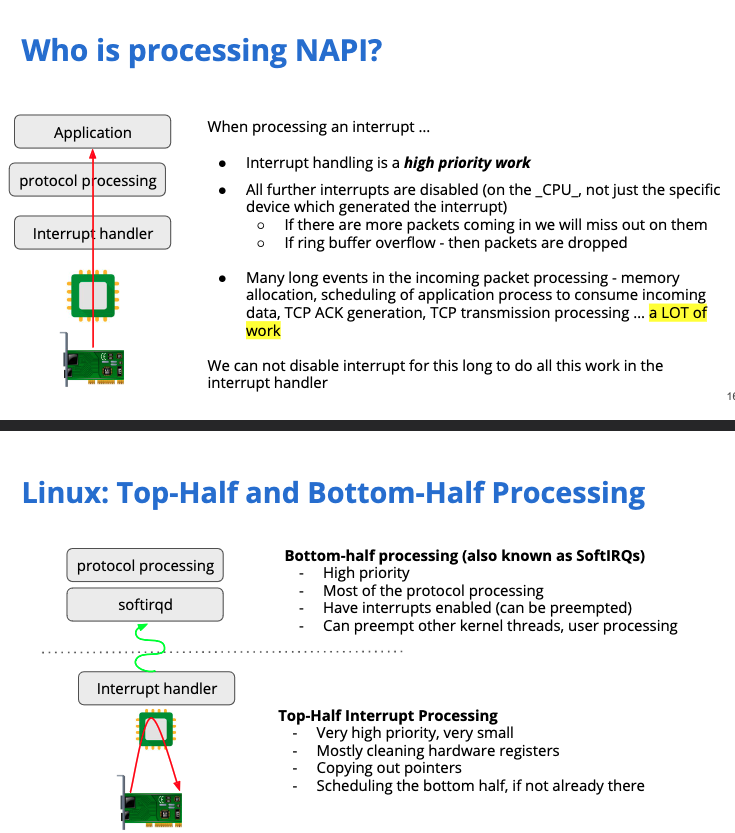
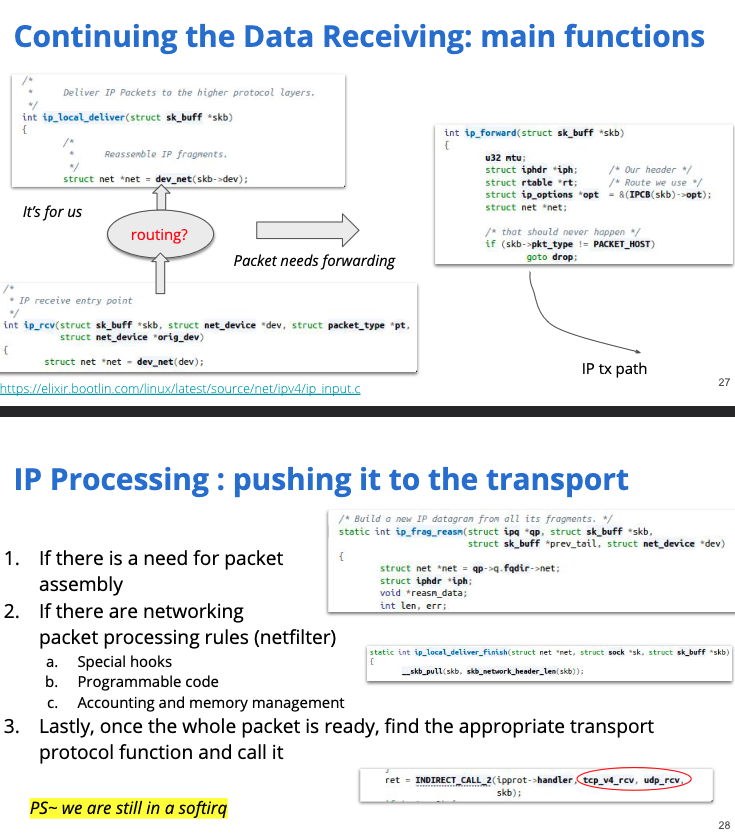
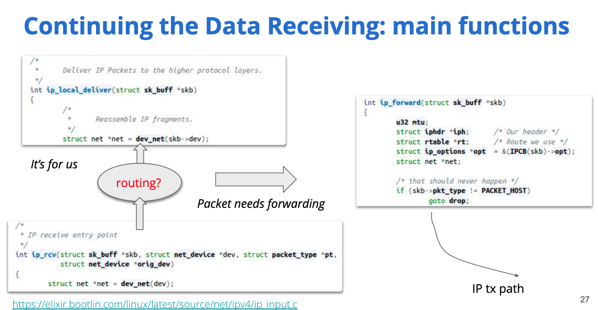
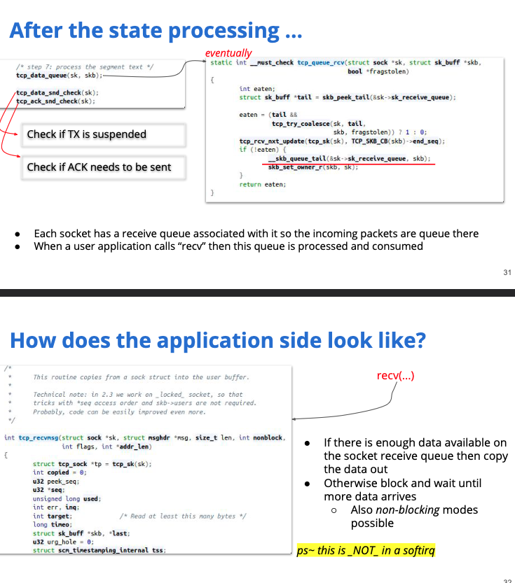
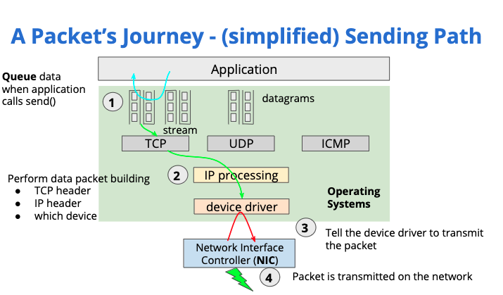
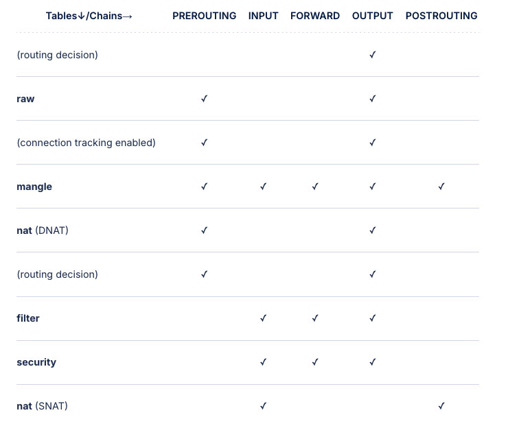

## CIDR Block
Reserved IPs: 1st & last in CIDR block
- 1st address in a subnet is the “network address” and cannot be assigned to a host (host ip).
- last address in a subnet is the “broadcast address” (used for sending packets to all hosts on the network - multicast)

## What happens when you visit google.com from your laptop?
**Devices and Interrupts**
1. When you press the "enter" key on your keyboard, the keyboard (device) sends a hardware interrupt on its interrupt request queue (IRQ), which is mapped to an interrupt vector (`int`).
2. When an interrupt is received, the CPU looksup the interrupt vector to get the interrupt handler from the Interrupt Descriptor Table (IDT) and runs the handler.
...

**DNS Lookup**
Assuming you are accessing from your home network, your laptop will be assigned a private IP addr by your home router over DHCP.
1. DNS resolution of website to IP address. If the dns entry is present in browser cache `chrome://net-internals/#dns`, that's used. If not, the browser calls `gethostbyname` C function to perform lookup. This function checks the local `/etc/hosts` file before trying to resolve the hostname through DNS.
2. If gethostbyname does not have it cached nor can find it in the hosts file then it makes a request to the DNS server configured in `/etc/resolv.conf`. This is typically the local router or the ISP's caching DNS server.
```sh
nslookup google.com
Server:         192.168.86.1 <----------- this is the DNS server we are using
Address:        192.168.86.1#53

Non-authoritative answer:
Name:   google.com
```
```sh
#/etc/resolv.conf
# This file is automatically generated.
#
search lan
nameserver 192.168.86.1 <----------- this is the DNS server we are using
```
2.1. If the DNS server is on the same subnet, the host's network library uses `ARP` for getting the MAC address of the local DNS server. (MAC is used for addressing as DNS server is on the same network)
2.2. Otherwise (different subnet), we need to send the packet first to the local gateway router which will forward the packet to the DNS server on some other network. To send the packet to the local gateway router, we also use `ARP`.
3. DNS client can establish a UDP socket connection on port 53 and lookup the hostname to get the IP. If the local ISP/DNS server does not have it, then a recursive DNS lookup is requested.

**Opening Socket**
4. Once the browser has the resolved IP address of the destination server, it makes a `socket` call to the system library, requesting a TCP socket stream. (Data will be sent down the Networking layers -- layer 4..2)
5. This request is passed to the Transport layer (Layer 4) in the host's networking stack where a TCP segment is created. The destination port is added to the header, source port is chosen from within the kernel's dynamic port range `ip_local_port_range`.
6. Segment is sent to the Network Layer (Layer 3), which encapsulates the TCP packet with an IP header. The dst IP address (google.com's IP), source IP address is added to the IP header (for inter-network routing).
7. Packet is sent to the Link Layer (Layer 2), which encapsulates the IP datagram with the src MAC (ie host's NIC MAC address), dst MAC (MAC address of the local router).

> This frame was initiated by the web browser when it created a message requesting to download the web page found at IP address 192.168.1.102
> The source and destination IP addresses were added to the message to create a packet, then the source and destination MAC addresses were added to the packet to create the frame.

**Routing**
Eventually, the packet reaches the local router. The local router will perform NATing by replacing source IP with the router's source IP (public IP); dst MAC with the next hop's MAC so that the response will be routable.
Each router along the way extracts the destination address from the IP header and routes it to the appropriate next hop if the dst IP does not match the subnet mask of the local network. The time to live (TTL) field in the IP header is decremented by one for each router that passes. The packet will be dropped if the TTL field reaches zero or if the current router has no space in its queue (perhaps due to network congestion).
If the dst IP matches the local subnet mask, ARP may be performed to resolve the MAC address for the dst IP in the local network. This is st the router can deliver the packet to the actual dst host.


>Frame is Forwarded Through the Switch
> The frame arrives at the switch and it is opened to find the destination MAC address. This MAC address is found in the routing table so it sends it out to Port 0.
> Note that the switch only opens the frame to determine the MAC address. A switch is a layer 2 device and is only concerned with layer 2 (MAC) addresses. It doesn’t touch the packet or care what the IP address is.

> Frame arrives at the dst server
> If the MAC address in the frame doesn’t match the device’s MAC address, the frame will be discarded by the Data Link Layer (Layer 2).
> If the IP address in the packet doesn’t match the device’s IP address, the packet will be discarded by the Network Layer (Layer 3).
> If a message is sent to an application (port number) that is not running in the device it will be discarded by the Transport Layer (Layer 4).


E.g.
1. H1 creates an IP packet with its own IP address (192.168.86.21) as the source and H2 (192.168.2.2) as the destination. To know whether dst is local/remote, H1 checks its own IP addr + subnet mask + dst IP.

`broadcast_address (ip): 192.168.86.255`; `subnet_mask (ip): 255.255.255.0`
so `local subnet range for H1: 192.168.86.0/24` i.e. IP addrs in 192.168.86.1 - 192.168.86.254 range are local.

Our destination 192.168.2.2 is outside of the local subnet so we have to use the default gateway for routing the packet out of the network to the dst server.

```
ipconfig getsummary en0 
<dictionary> {
  IPv4 : <array> {
    0 : <dictionary> {
      Addresses : <array> {
        0 : 192.168.86.21 <------------ this host's IP
      }
...
rebinding_t2_time_value (uint32): 0x11af6
subnet_mask (ip): 255.255.255.0 <------------------------------------------------ uses subnet mask + its own IP addr + dst IP addr to check if dst is local/remote
broadcast_address (ip): 192.168.86.255 <-------------------------- broadcast addr + subnet mask used to check local network subnet range
router (ip_mult): {192.168.86.1}
domain_name (string): lan
domain_name_server (ip_mult): {192.168.86.1}
...
```
2. H1 will build an ethernet frame (Layer 2), putting its own src MAC addr and use ARP to find the dst MAC addr of the local gateway. (`arp -a`)
```
arp -a

Interface: 192.168.86.1 --- 0x4
  Internet Address      Physical Address      Type
  192.168.86.1         fa-16-3e-3f-fd-3c     dynamic
```
H1 has an ARP entry for the local gateway 192.168.86.1. If not, it would have sent an ARP request to resolve the MAC addr. We now have an Ethernet frame that carries an IP packet with the following addresses:

```
3. H1 constructs a TCP packet (layer 4) then goes down to layer 3 (IP layer) and src IP (H1's IP), dst IP addr (H2) are added to the IP headers. Down to layer 2 (data link layer), src MAC (H1's MAC) and dst MAC (gateway's MAC) are added to the link layer datagram.
```
[Data Link frame (layer 2) [IP datagram (layer 3) [TCP packet (layer 4) ... ]]]
```
4. Router receives the data-link frame (since dst MAC addr matches router's MAC addr, router accepts this) and de-encapsulates the frame to extract the IP packet. Since dst IP addr doesn't match router's IP addr, router checks the routing table to forward the packet.
- If no entry for dst IP in routing table, packet is discarded.
- If entry is found in routing table, router transfers packet to the network interface connected to the destination network.
    - If interface is connected to the destination network, interface encapsulates packet in a data-link frame and forwards the frame to the dst network.
    - If the interface is connected to the next-hop router that knows how to reach the dst network, interface also encapsulates packet in a data link frame and forwards frame to next-hop router.


**How are route tables populated**
- Static routes
- Dynamic routing (e.g. using OSPF / RIP / BGP)

OSPF - Interior Gateway Protocol (within same Autonomous System)
BGP - Exterior Gateway protocol (for connecting multiple networks e.g TGW uses BGP)

**(3way) TCP handshake**
8. Client chooses an initial sequence number (ISN) and sends packet to server with `SYN` flag set indicating it is setting the ISN. (`SYN:client_isn`)
9. Server receives `SYN` and chooses its own ISN, setting `SYN` to indicate its sequence number. It also copies client's `ISN+1` into the `ACK` flag. (`SYN:server_isn,ACK:client_isn+1`)
10. Client acks. (`ACK:server_isn+1,SYN:client_isn+1+1`)
Data is transferred as follows:
- As one side sends N data bytes, it increases its SEQ by that number
- When the other side acknowledges receipt of that packet (or a string of packets), it sends an ACK packet with the ACK value equal to the last received sequence from the other

To close the connection:
- The closer sends a FIN packet
- The other sides ACKs the FIN packet and sends its own FIN
- The closer acknowledges the other side's FIN with an ACK

**TLS handshake**
11. client sends a `ClientHello` message with its TLS version, list of cipher algos + compression methods supported.
12. server replies with `ServerHello` message with the TLS version, selected cipher algo + compression method + server's public cert signed by CA. The cert contains a pub key that will be used by the client to encrypt the rest of the handshake until a symmetric key is exchanged.
13. Client verifies the server's cert against its list of trusted CAs (`update-ca-certificates` to update trust store).
    - client parses the server's cert to get the `cert signing request (CSR)` which contains domain details + pub key of server AND `encrypted(hash(CSR))` which is signed using the CA's private key.
    - hash of server's CSR is calculated -- hash(CSR). The hashing algo is agreed upon in step 12.
    - public key of CA is used to decrypt `encrypted(hash(CSR))` to get `hash(CSR)`
    - the `hash(CSR)` values are compared.
14. If cert can be trusted, client generates a random string (symmetric key) and encrypts this with the server's public key.
15. Server decrypts the random bytes using its private key and generates its own copy of the symmetric master key.
16. Client sends a `Finished` message to the server, encrypting a hash of the transmission so far with its symmetric key.
17. Server generates its own hash of the transmission so far and decrypts the client-sent hash using the symmetric key to check that it matches. If it does, it sends a `Finished` message as well to the client encrypted using the symmetric key.
18. From this stage on, data sent over HTTP is TLS encrypted using the symmetric key.


**Cert Signing & Issuance**
In the beginning, you request a certificate from a Certificate Authority (CA) by providing a Certificate Signing Request (CSR), a request that consists of domain details and public key of the server.

The CA will then issue a digital certificate:
1. The CSR is signed with hashing algorithms i.e., SHA256/md5 tp generate `hash(CSR)`
2. Then the hashed CSR is encrypted using the CA's private key. i.e., `encrypted(hash(CSR))`
3. Then `encrypted(hash(CSR))` is attached to CSR to form a digital certificate and for verification.

In short:
`Digital certificate = CSR + encrypted(hash(CSR))`

**ARP**
Between Networks: When packets are sent from one network to another, routers use IP addresses to route the packets. Once the packet reaches the destination network, the router determines the MAC address of the destination device using ARP, allowing the packet to be delivered to the correct device.

ARP is used to find out the MAC address of the gateway router in the local subnet to send packets out of (need MAC address as that is static whereas IP address is dynamically allocated). An ARP table stores a mapping of IP to MAC address.
```sh
# local arp table (mapping of IP to MAC)
arp -a
...
? (192.168.86.1) at 70:3a:cb:b8:e2:20 on en0 ifscope [ethernet] <------nameserver MAC
...
```

Initially:
- Known: Sender MAC, Sender IP, Target IP
- Unknown: Target MAC -- so target MAC is set to Broadcast (i.e. all NICs on the network will have to receive ARP packet and respond).

1. The ARP cache is checked for an ARP entry for the target IP. If cache hit, library function returns with target MAC.
2. Otherwise, route table `netstat -rn` is looked up to see if the target IP matches subnets on the local route table. If so, then NIC associated with that subnet is used. Otherwise, NIC of default gateway is used.
3. MAC addr of the NIC is looked up and network library sends a Layer 2 (Data Link) ARP request
```
Sender MAC: interface:mac:address:here
Sender IP: interface.ip.goes.here
Target MAC: FF:FF:FF:FF:FF:FF (Broadcast) <----------- BROADCAST addr since we do not know target MAC
Target IP: target.ip.goes.here
```
4. All hosts on the same network as the host will receive the ARP broadcast but only the host that has the matching Target IP will respond with the ARP respond, setting the Target MAC to it's own.
```
Sender MAC: target:mac:address:here
Sender IP: target.ip.goes.here
Target MAC: interface:mac:address:here
Target IP: interface.ip.goes.here
```


## TCP States
### TCP Connection establish (3 way)

```
      TCP A                                                TCP B

  1.  CLOSED                                               LISTEN

  2.  SYN-SENT    --> <SEQ=100><CTL=SYN>               --> SYN-RECEIVED

  3.  ESTABLISHED <-- <SEQ=300><ACK=101><CTL=SYN,ACK>  <-- SYN-RECEIVED

  4.  ESTABLISHED --> <SEQ=101><ACK=301><CTL=ACK>       --> ESTABLISHED

  5.  ESTABLISHED --> <SEQ=101><ACK=301><CTL=ACK><DATA> --> ESTABLISHED

          Basic 3-Way Handshake for Connection Synchronization
```
1. When a new TCP connection is opened, the client (initiator) sends a SYN packet to the server (receiver) and updates its state to SYN-SENT.
2. The server will then send a SYN-ACK in reply to the client which changes its connection state to SYN-RECEIVED.
3. If everything worked properly, the client will reply with an ACK and the connection is marked as ESTABLISHED on both end-point.
Now the client and the server are ready to transfer data.

#### SSL Handshake (happens AFTER TCP handshake)

In TLS, TCP handshake done first then SSL handshake done to exchange symmetric key for encrypting data.


1. The client sends a request to the server for a secure session. The server responds by sending its X.509 digital certificate to the client.
2. The client receives the server's X.509 digital certificate.
3. The client authenticates the server, using a list of known certificate authorities.
4. The client generates a random symmetric key and encrypts it using server's public key.
5. The client and server now both know the symmetric key and can use the SSL encryption process to encrypt and decrypt the information contained in the client request and the server response.


### TCP Connection teardown (4 way)

```
 TCP A                                                TCP B

  1.  ESTABLISHED                                          ESTABLISHED

  2.  (Close)
      FIN-WAIT-1  --> <SEQ=100><ACK=300><CTL=FIN,ACK>  --> CLOSE-WAIT

  3.  FIN-WAIT-2  <-- <SEQ=300><ACK=101><CTL=ACK>      <-- CLOSE-WAIT

  4.                                                       (Close)
      TIME-WAIT   <-- <SEQ=300><ACK=101><CTL=FIN,ACK>  <-- LAST-ACK

  5.  TIME-WAIT   --> <SEQ=101><ACK=301><CTL=ACK>      --> CLOSED

  6.  (2 MSL)
      CLOSED

                         Normal Close Sequence
```
*Note: TCP B sends ACK first; then FIN separately. As TCP B may want to send data to TCP A between last ACK .. FIN before actually terminating conn.*

1. The client sends a FIN packet to the server and updates its state to FIN-WAIT-1.
2. The server receives the termination request from the client and responds with an ACK. After the reply the server will be in a CLOSE-WAIT state.
3. As soon as the client receives the reply from the server, it will go to the FIN-WAIT-2 state.
While the connection is terminated from a client point of view, the server has to terminate its connection as well. This happens directly after the server sent its last ACK.
4. The server is still in the CLOSE-WAIT state and it will independently follow up with a FIN, which updates the state to LAST-ACK.
5. Now the client receives the termination request and replies with an ACK, which results in a TIME-WAIT state.
6. The server is now finished and sets the connection to CLOSED immediately.
7. The client stays in the TIME-WAIT state for a maximum of four minutes (defined by RFC793 and the maximum segment lifetime) before setting the connection to CLOSED as well.


A connection can be in one of the following states:
- CLOSED: a TCP connection is inactive and no data can be sent.
- LISTEN: the TCP server is waiting for a client to open a new connection.
- SYN_RECVD: a TCP server has received the first TCP message from the client in the three-way TCP open hand-shake.
- SYN_SENT: a TCP client has sent its first message in the three-way handshake. This message has the SYN bit set. 
- ESTABLISHED: the connection can start to send and receive data.
- FIN_WAIT_1: one side of a TCP connection shuts down by sending a message with the FIN bit set and waits for a FIN from the other side of the connection.
- FIN_WAIT_2: one side of a TCP connection has sent a FIN and received the ACK from the other side of the connection.
- CLOSE_WAIT: one side of a TCP connection receives a shutdown from the other side of the connection by receiving a message with the FIN bit set. It sends a message with the ACK bit set acknowledging the FIN.
- CLOSING: one side of a connection in FIN_WAIT_1 state gets a shutdown from the other side by receiving a FIN message and sends an ACK for that FIN and awaits the other side to send its final ACK.
- TIME_WAIT: one side of a connection sends its final ACK. The connection waits for a period of time to be sure of the other side has terminated completely.
- RST_ACT: one side of a connection sends its final FIN and awaits a final ACK from the other side of the connection. Upon reception of the final ACK, the connection is closed.

**Why is `RST` flag required?**
As a general rule, reset (RST) must be sent whenever a segment arrives which apparently is not intended for the current connection. A reset must not be sent if it is not clear that this is the case.

Examples on how `RST` is used:
Eg1  (recovery from old duplicates -- `SYN` packet in line 3 in this case):

```
 TCP A                                                TCP B

  1.  CLOSED                                               LISTEN

  2.  SYN-SENT    --> <SEQ=100><CTL=SYN>               ...

  3.  (duplicate) ... <SEQ=90><CTL=SYN>               --> SYN-RECEIVED

  4.  SYN-SENT    <-- <SEQ=300><ACK=91><CTL=SYN,ACK>  <-- SYN-RECEIVED

  5.  SYN-SENT    --> <SEQ=91><CTL=RST>               --> LISTEN <---------- NOTE the RST flag from TCP A here that's used to tell TCP B to RST the connection and return to LISTEN state


  6.              ... <SEQ=100><CTL=SYN>               --> SYN-RECEIVED

  7.  SYN-SENT    <-- <SEQ=400><ACK=101><CTL=SYN,ACK>  <-- SYN-RECEIVED

  8.  ESTABLISHED --> <SEQ=101><ACK=401><CTL=ACK>      --> ESTABLISHED

                    Recovery from Old Duplicate SYN
```
1. At line 3, an old duplicate SYN arrives at TCP B.
2. TCP B cannot tell that this is an old duplicate, so it responds normally (line 4).
3. At line 5, TCP A detects that the ACK field is incorrect and returns a RST (reset) with its SEQ field selected to make the segment believable.
4. TCP B, on receiving the RST, returns to the LISTEN state.
5. When the original SYN finally arrives at line 6(sent from TCP A at line 2), the synchronization proceeds normally.

Eg2. Assume that two user processes A and B are communicating with one another when a crash occurs causing loss of memory to A’s TCP.When the TCP is up again, A is likely to start again from the beginning or from a recovery point. As a result, A will probably try to OPEN the connection again or try to SEND on the connection it believes open. 

```
TCP A                                           TCP B

  1.  (CRASH)                               (send 300,receive 100)

  2.  CLOSED                                           ESTABLISHED

  3.  SYN-SENT --> <SEQ=400><CTL=SYN>              --> (??) <--------- after TCP A crashes, TCP A restarts from TCP conn est stage (SYN-SENT) but TCP B thinks that the connection is already ESTABLISHED; so TCP B sends ACK 100 to tell TCP A this is the SEQ # B expects; TCP A seeing that whatever it sent is unexpected, sends a RST flag with the expected SEQ # 100, causing the whole TCP conn to be reestablished

  4.  (!!)     <-- <SEQ=300><ACK=100><CTL=ACK>     <-- ESTABLISHED

  5.  SYN-SENT --> <SEQ=100><CTL=RST>              --> (Abort!!)

  6.  SYN-SENT                                         CLOSED

  7.  SYN-SENT --> <SEQ=400><CTL=SYN>              -->

                     Half-Open Connection Discovery
```
When the SYN arrives at line 3, TCP B, being in a synchronized state, and the incoming segment outside the window, responds with an acknowledgment indicating what sequence it next expects to hear (ACK 100). TCP A sees that this segment does not acknowledge anything it sent and, being unsynchronized, sends a reset (RST) because it has detected a half-open connection. TCP B aborts at line 5. TCP A will continue to try to establish the connection; the problem is now reduced to the basic 3-way handshake of figure 1.


## Why need to use NAPI polling instead of interrupts when network packet rcv
Once a packet arrives on a network interface, the kernel must usually perform a fair amount of protocol-processing work before the data in that packet can be delivered to the user-space application that is waiting for it. Once upon a time, the network interface would interrupt the CPU when a packet arrived; the kernel would acknowledge the interrupt, then trigger a software interrupt to perform this processing work. The problem with this approach is that, on busy systems, thousands of packets can arrive every second; handling the corresponding thousands of hardware interrupts can run the system into the ground. 

The solution to this problem is NAPI which is a polling API for the kernel to poll for new packets periodically instead of being overloaded with interrupts. This allows the kernel to disable packet-reception interrupt most of the time and rely on the network stack to poll for new packets periodically.

Regardless of whether interrupts are turned on or off on a given ring, packets will still accumulate in the ring. This means that if the operating system were to look at the ring, it could see that there were packets available to be processed. If the OS marks the received entries processed, then the hardware will continue delivering packets into the ring. When the OS decides to turn off interrupts and process the ring with a dedicated thread, we call this polling.

Polling works in conjunction with dedicated rings being used for classification. In essence, when the OS notices that there's a large number of packets coming in on the ring, it will then transition the ring to polling mode, disabling interrupts. The dedicated thread will then continue to poll the ring for work, consuming up to a fixed number of packets in any one poll. After that, if there is still a large backlog, it will keep polling until a low watermark is reached, at which point it will disable polling and transition back to interrupt based processing.

Each time a poll occurs, the packets will be delivered in bulk to the networking stack. So if 50 packets came in in-between polls, then they would all be delivered at once.

As with everything we've seen, there is a trade off of sorts. When you're in polling mode, there can be an additional latency hit to processing some of these packets; however, polling can make it much easier to saturate 10 Gbit/s and faster devices with very little CPU.

## Network Interfaces
Can be physical (e.g. host nic `eth0`) / Virtual (e.g. TUN / bridge interface).
Network interfaces need to have an IP address to be ... addressable. They can be attached to network namespaces / peered (creating routeable networks).

While this is a broad generalization, the simplest way to think of a networking card is that it has five primary pieces:
1. A MAC Address that it can use to filter incoming packets.
2. A ring, or circular buffer, that packets are received into from the network.
3. A ring, or circular buffer, that packets are sent from to the network.
4. The ability to generate interrupts.
5. A way to program all of the above, generally done with PCI memory-mapped registers.

**Why use a circular buffer?**
Circular buffers are often used because of the property that they consume a fixed amount of memory and they handle the model of a single producer and a single consumer rather well. One end, the producer, places data in the buffer and moves a head pointer, while another end, the consumer, removes data from the buffer, moving the tail pointer.

**What are circular buffers used for?**
Each NIC has a ring buffer and they occupy a fixed chunk of memory in normal system memory. When the hardware wants to access it (to write network pkts / read network pkts), it performs DMA (direct memory access).

All data the gets written to / read from the buffer is repr by an entry (ie descriptor). A descriptor consists of:
1. Buffer address
2. Buffer length
3. Packet metadata

There are 2 rings -- 1 for RCV, 1 for TX.
Eg. for the RCV ring:
1. Buffer address - memory address for placing the incoming packet
2. Buffer length - how big the buffer is
When a packet arrives at the NIC (and dst MAC address of the packet matches MAC address of the NIC), the NIC will generally raise an interrupt to let the kernel know to check the ring.
(By default, if the destination MAC address of the Ethernet header doesn't match the networking card's MAC address, and it isn't a broadcast or multicast packet, then it will be dropped.)

**Overview RCV flow**
1. Initially the NIC's RCV ring buffer is empty.
2. The OS fills all the descriptors with pointers to where the NIC can put packets it receives.
3. Since the entire ring is filled, the OS will set its pointer to the start of the RX ring buffer. As the hardware RCVs packets, the hardware will bump its pointer and send the OS an interrupt.
4. When the OS RCVs the interrupt, it reads where the hardware pointer is and processes the packets between it's ptr and the hardware's ptr. Once it's done, the OS updates its pointer by setting it to the hardware ptr's addr. The previous ring buffer addresses can then be overwritten and memory is freed.
(When packets are sent, the flow is similar. The OS fills in descriptors and notifies the hardware. Once the hardware has sent them out on the wire, it updates its hardware ptr to match that of the OS. The hardware then sends an interrupt to let the kernel know which descriptors have been written to the network, allowing the OS to free the associated memory in the TX ring buffer.)


1. Driver is loaded and initialized.
2. Packet arrives at the NIC from the network.
3. Packet is copied (via DMA) to a ring buffer in kernel memory.
4. Hardware interrupt is generated to let the system know a packet is in memory.
5. Driver calls into NAPI to start a poll loop if one was not running already(via napi_schedule or other NAPI APIs from device).
6. ksoftirqd processes run on each CPU on the system. They are registered at boot time. The ksoftirqd processes pull packets off the ring buffer by calling the NAPI poll function that the device driver registered during initialization.
7. Memory regions in the ring buffer that have had network data written to them are unmapped.
8. Data that was DMA’d into memory is passed up the networking layer as an skb for more processing.
9. Network data frames are handed to the protocol layers from the queues.
10. Protocol layers process data.
11. Data is added to receive buffers attached to sockets by protocol layers.


**Overview Send Flow**

*The NIC signals the transmission complete via the NET_RX IRQ.*

**Where does the NIC sit?**


**Ring Buffers & DMA**
When data is received or sent over the network, they are written in ring buffers using Direct Memory Access (DMA) so that NICs do not need to interrupt the CPU to write to memory and can just independently write to memory themselves.


## Virtual Network Interfaces
**1. Come in pairs (ie has 2 interfaces)**
- one side of the pair is typically attached to 1 netowrk namespace (e.g. container / VM / application)
- the other is typically attached to the host / another network namespace (e.g bridge (something like a switch) -- for routing packets within hosts connected to the bridge / another container)

**How a veth pair is created**
```
ip link add veth0 type veth peer name veth1
```
This creates two virtual Ethernet interfaces:
- veth0: One side of the pair.
- veth1: The other side of the pair.
These interfaces are now linked, and any data sent on veth0 will be received on veth1 and vice versa.

**1.1. Example of a veth pair:**
- veth0: The interface inside a container.
- veth1: The interface on the host or connected to a virtual bridge.
In this setup, if a container (connected via veth0) sends a packet, the packet is received by the corresponding veth1 interface, which can then be processed by the host's networking stack, or vice versa.

**1.2. Why does it come in pairs?**
- Network namespace isolation
    - e.g. veth pair: One interface (veth0) is placed in a container's network namespace, while the other (veth1) stays in the host's namespace or a bridge. This allows the container to send packets to the host and vice versa, while maintaining isolation between the two namespaces.
- Container-to-host communcation
    - veth0 (container side): Inside the container, which has its own IP address.
    - veth1 (host side): This interface on the host can either be connected to a bridge (for communication with other containers) or directly to the host’s network stack.
- Bridge connections (The veth interfaces allow traffic to flow between the containers via the bridge.)
    - Container 1: veth0 connects to the bridge interface br0, and the other end (veth1) is connected to the container.
    - Container 2: Similarly, veth2 connects to br0, with the other end (veth3) inside the container.

## Creating a Bridge (using network namespaces)

Considering the following properties:
- network NS can have their own network routes;
- virtual ethernet interfaces comes in pairs;
- it's possible to assign a network interface to a different network NS;

it is then possible to build an example of multiple network NSs connected together through a Linux bridge and routing rules inside the same physical host. A bridge device give us the virtual equivalent of a network switch, allowing us to connect multiple interfaces (virtual or not), and have them communicate with each other.

The following is a conceptual schema:
```
br-veth{1,2}: veth attached to the bridge
veth{1,2}: veth part of their respective network NS

############################################
      br-Veth1          Veth1 +-------------+
         +--------------------+ namespace 1 |
         |                    +-------------+
+--------+
|        |
| bridge |
|        |
+--------+
         |              Veth2 +-------------+
         +--------------------+ namespace 2 |
      br-Veth2                +-------------+
############################################
```

**Steps**
1. two network NS will be created ns1,ns2:
```
>>> ip netns add ns1
>>> ip netns add ns2
```
2. two pairs of veth will be created (veth1 <-> br-veth1; veth2 <-> br-veth2)
```
>>> ip link add veth1 type veth peer name br-veth1
>>> ip link add veth2 type veth peer name br-veth2
```
3. two of the new veths will be attached to the network NS (br-veth is just a convenient naming convention but it does not identify a veth connected to a bridge).
```
# bind veth1 to ns1; veth2 to ns2
>>> ip link set veth1 netns ns1
>>> ip link set veth2 netns ns2
```
The two veth{1,2} will be shown only in their respective networks NS:
```
>>> ip netns exec ns1 ip link list
# initially loopback,veth1 will default to DOWN
1: lo: <LOOPBACK> mtu 65536 qdisc noop state DOWN mode DEFAULT group default qlen 1
    link/loopback 00:00:00:00:00:00 brd 00:00:00:00:00:00
32: veth1@if31: <BROADCAST,MULTICAST,UP,LOWER_UP> mtu 1500 qdisc noqueue state DOWN mode DEFAULT group default qlen 1000
    link/ether 4e:8c:92:72:f5:cd brd ff:ff:ff:ff:ff:ff link-netnsid 0
```
Note: the veth1 is marked as DOWN. The same goes for veth2.
4. Bring up network interfaces
```
>>> ip link set veth1 up
>>> ip link set veth2 up
>>> ip link set br-veth1 up
>>> ip link set br-veth2 up
```
5. Assign the IP address 192.168.1.11 with netmask 255.255.255.0 to veth1. Bring veth1 up from within ns1.
```
>>> ip netns exec ns1 ip addr add 192.168.1.11/24 dev veth1
>>> ip netns exec ns1 ip link set veth1 up
```
6. Assign the IP address 192.168.1.12 with netmask 255.255.255.0 to veth2. Bring veth2 up from within ns2.
```
>>> ip netns exec ns2 ip addr add 192.168.1.12/24 dev veth2
>>> ip netns exec ns2 ip link set veth2 up
```
7. Even when the two veth have assigned IP address they cannot communicate between each other: the reason is that there's no configured interface on the default network namespace which can send the traffic to and from the two veth interfaces.

Adding a bridge it's the only way to go further:
```
# creates the bridge br1, brings it up, assigns br-veth1 and br-veth2 as its members
# and assigns an IP addr 192.168.1.10/24 to the bridge
>>> ip link add name br1 type bridge
>>> ip link set br1 up
>>> ip link set br-veth1 master br1
>>> ip link set br-veth2 master br1
>>> ip addr add 192.168.1.10/24 dev br1
```
8. Test connectivity from ns1 <-> ns2
```
# ping veth2 from ns1
>>> ip netns exec ns1 ping 192.168.1.12
# ping veth1 from ns2
>>> ip netns exec ns2 ping 192.168.1.11
```

## Why does a packet appear multiple times in tcpdump?
Something I’ve been observing recently but haven’t fully understood is – sometimes I’ll be on a machine which has [ref](https://jvns.ca/blog/2017/09/03/network-interfaces/)
- virtual network interfaces for each container (vethXXXXXXX)
- a bridge interface (cni0)
- and a “real” network interface to the outside world (eth0)

When containers send packets to the outside world and I’m running `tcpdump -i any`, I’ll see those packets **3** times.

**Answer**
Since there are 3 NICs and the packet flow is:
```
eth0 (host nic) -> cni0 (bridge) -> vethXXX (container nic)
```
Also `tcpdump -i any` captures packets from all interfaces and so we see the packet 3 times.

## OS Packet Recv Flow


1. Packet arrives at NIC from network
2. Packet is copied to kernel memory ring buffer (RX) using DMA
3. Hardware interrupt to let kernel know packet is in memory
*Networking stack: “top-half”*

4. Device driver calls New API (NAPI) to start poll loop. NAPI processes a certain number of "weight" packets in one go by polling the device driver to check for packets.
    - if not enough packets, then yield.
*Networking stack: “bottom-half” (softirqs)*
5. Ksoftirqd then pulls packet out of the ring buffer via NAPI poll function.
*Socket Kernel Buffer (SKBs)*
6. Memory regions that were written to during DMA in kernel memory ring buffer read to build data packets (ie. SKBs).
*Local IP processing*


7. Data packets (represented as socket kernel buffer / SKB) are pushed to networking layer at `ip_rcv()`. Netfilter is performed on the packet to route packets to their destinations. E.g. if packet is bound for this host -- `ip_local_deliver()` / if dst IP is bound for a remote host `ip_forward()`.
    1. First the packet arrives at `Ingress` hook. The ingress hook is attached to a particular network interface. Here we can perform filtering in early stage.
    2. Then packet traverse to `PREROUTING` hook, the packets is intercepted just before the kernel performs any routing decisions. At this stage packet has arrived on a networking interface but has not yet been processed with respect to systems routing table. Most common action that is performed on that hook is destination IP address translation.
    3. Now we enter Routing decision phase, the kernel analyzes the destination IP address of incoming packet and matches it to the entries in the routing table. Based on the most specific match or the most suitable route, the kernel will makes the decision to route the packet for local delivery assuming the address is associated with local system or forward the packet to appropriate network interface or gateway if the destination address is on a different network.
    4. Assuming it is a local address, the packet will traverse the `INPUT` hook. It’s main purpose is define the fate of incoming packets destined to our local processes. If allowed traffic will reach local application.

9. (L3) IP packet is delivered to higher layer transport protocol (L4). Find appropriate transport protocol (TCP/UDP) and call it.
    - e.g. for TCP, once tcp connection is established, this creates a tcp socket. Each socket has a receive queue associated with it so the incoming packets are queued there. When a user application calls `recv`, this queue is processed and data is copied into a user buffer.
10. Application process the packets


## OS Packet Send Flow
Sending path is less complex than recv as sending is synchronous (compared to recv).

1. Application performs syscall to send data over TCP using TCP socket.
2. Data is copied from user buffer to socket write queue (user space), which in turn writes data into socket kernel buffer (SKB) (kernel space). -- mode switch here
3. (L4) TCP parameters, ACKs, window size are checked. TCP header is built from the SKB before pushing the constructed TCP packet onto the (L3) lower IP layer.
4. In the IP Layer, IP packet is constructed and the netfilter rules are evaluated to route the IP packet out of the network interface (ie network device is also resolved using the dst IP of the data packet here).
    1. First packet hit the routing decision and then goes to `OUTPUT` hook, at this stage we can filter any locally generated outgoing traffic.
    2. Then packet moves to `POSTROUTING` hook. At this point kernel has made necessary routing decisions. Most common operation at this stage is source address translation, where we replace the source IP of packet with the IP of outgoing interface so the return traffic knows how to get back.
    3. Now the packet goes to network interface. If the destination IP is on different network, the routing decision will forward the packet to `FORWARD` hook. This hook is for packet that are neither locally generated nor destined for local system. The primary purpose of `FORWARD` hook is to handle packets that are forwarded by system from one network to another. Here filtering can be performed if system is acting as router or gateway.
5. IP packet is forwarded out of network interface

**Netfilter Hooks**
There are 5 netfilter hooks that programs can register with. As packets progress through the stack, they will trigger the kernel modules that have registered with these hooks. The hooks that a packet will trigger depends on whether the packet is incoming or outgoing, the packet’s destination, and whether the packet was dropped or rejected at a previous point.

The following hooks represent these well-defined points in the networking stack:

- `NF_IP_PRE_ROUTING`: This hook will be triggered by any incoming traffic very soon after entering the network stack. This hook is processed before any routing decisions have been made regarding where to send the packet.
- `NF_IP_LOCAL_IN`: This hook is triggered after an incoming packet has been routed if the packet is destined for the local system.
- `NF_IP_FORWARD`: This hook is triggered after an incoming packet has been routed if the packet is to be forwarded to another host.
- `NF_IP_LOCAL_OUT`: This hook is triggered by any locally created outbound traffic as soon as it hits the network stack.
- `NF_IP_POST_ROUTING`: This hook is triggered by any outgoing or forwarded traffic after routing has taken place and just before being sent out on the wire.

**IPTables Tables and Chains**

The iptables firewall uses tables to organize its rules. These tables classify rules according to the type of decisions they are used to make. For instance, if a rule deals with network address translation, it will be put into the nat table. If the rule is used to decide whether to allow the packet to continue to its destination, it would probably be added to the filter table.

Within each iptables table, rules are further organized within separate “chains”. While tables are defined by the general aim of the rules they hold, the built-in chains represent the netfilter hooks which trigger them. Chains determine when rules will be evaluated.

The names of the built-in chains mirror the names of the netfilter hooks they are associated with:
- `PREROUTING`: Triggered by the `NF_IP_PRE_ROUTING` hook.
- `INPUT`: Triggered by the `NF_IP_LOCAL_IN` hook.
- `FORWARD`: Triggered by the `NF_IP_FORWARD` hook.
- `OUTPUT`: Triggered by the `NF_IP_LOCAL_OUT` hook.
- `POSTROUTING`: Triggered by the `NF_IP_POST_ROUTING` hook.

Chains allow the administrator to control where in a packet’s delivery path a rule will be evaluated. Since each table has multiple chains, a table’s influence can be exerted at multiple points in processing. Because certain types of decisions only make sense at certain points in the network stack, every table will not have a chain registered with each kernel hook.

**The Filter Table**

The filter table is one of the most widely used tables in iptables. The filter table is used to make decisions about whether to let a packet continue to its intended destination or to deny its request. In firewall parlance, this is known as “filtering” packets. This table provides the bulk of functionality that people think of when discussing firewalls.

**The NAT Table**

The nat table is used to implement network address translation rules. As packets enter the network stack, rules in this table will determine whether and how to modify the packet’s source or destination addresses in order to impact the way that the packet and any response traffic are routed. This is often used to route packets to networks when direct access is not possible.

**The Mangle Table**

The mangle table is used to alter the IP headers of the packet in various ways. For instance, you can adjust the TTL (Time to Live) value of a packet, either lengthening or shortening the number of valid network hops the packet can sustain. Other IP headers can be altered in similar ways.

This table can also place an internal kernel “mark” on the packet for further processing in other tables and by other networking tools. This mark does not touch the actual packet, but adds the mark to the kernel’s representation of the packet.

**The Raw Table**

The iptables firewall is stateful, meaning that packets are evaluated in regards to their relation to previous packets. The connection tracking features built on top of the netfilter framework allow iptables to view packets as part of an ongoing connection or session instead of as a stream of discrete, unrelated packets. The connection tracking logic is usually applied very soon after the packet hits the network interface.

The raw table has a very narrowly defined function. Its only purpose is to provide a mechanism for marking packets in order to opt-out of connection tracking.

**The Security Table**

The security table is used to set internal SELinux security context marks on packets, which will affect how SELinux or other systems that can interpret SELinux security contexts handle the packets. These marks can be applied on a per-packet or per-connection basis.



**Chain traversal order:**
e.g.
- Incoming packets destined for the local system: PREROUTING -> INPUT
- Incoming packets destined to another host: PREROUTING -> FORWARD -> POSTROUTING
- Locally generated packets: OUTPUT -> POSTROUTING

incoming packet destined for the local system will first be evaluated against the PREROUTING chains of the raw, mangle, and nat tables. It will then traverse the INPUT chains of the mangle, filter, security, and nat tables before finally being delivered to the local socket.

**IPTables Rules**
Rules are placed within a specific chain of a specific table. As each chain is called, the packet in question will be checked against each rule within the chain in order. Each rule has a matching component and an action component.

**Matching**
The matching portion of a rule specifies the criteria that a packet must meet in order for the associated action (or “target”) to be executed.

The matching system is very flexible and can be expanded significantly with additional iptables extensions. Rules can be constructed to match by protocol type, destination or source address, destination or source port, destination or source network, input or output interface, headers, or connection state among other criteria. These can be combined to create complex rule sets to distinguish between different traffic.

**Targets**
A “target” refers to the actions that are triggered when a packet meets the matching criteria of a rule. Targets are generally divided into two categories:

- **Terminating targets**: Terminating targets perform an action which terminates evaluation within the chain and returns control to the netfilter hook. Depending on the return value provided, the hook might drop the packet or allow the packet to continue to the next stage of processing.
- **Non-terminating targets**: Non-terminating targets perform an action and continue evaluation within the chain. Although each chain must eventually pass back a final terminating decision, any number of non-terminating targets can be executed beforehand.

**Conntrack**
Connection tracking allows iptables to make decisions about packets viewed in the context of an ongoing connection. The connection tracking system provides iptables with the functionality it needs to perform “stateful” operations.
Connection tracking is applied very soon after packets enter the networking stack.
The states tracked in the connection tracking system allow administrators to craft rules that target specific points in a connection’s lifetime. 

**Available States**
Connections tracked by the connection tracking system will be in one of the following states:
- `NEW`: When a packet arrives that is not associated with an existing connection, but is not invalid as a first packet, a new connection will be added to the system with this label. This happens for both connection-aware protocols like TCP and for connectionless protocols like UDP.
- `ESTABLISHED`: A connection is changed from NEW to ESTABLISHED when it receives a valid response in the opposite direction. For TCP connections, this means a SYN/ACK and for UDP and ICMP traffic, this means a response where source and destination of the original packet are switched.
- `RELATED`: Packets that are not part of an existing connection, but are associated with a connection already in the system are labeled RELATED. This could mean a helper connection, as is the case with FTP data transmission connections, or it could be ICMP responses to connection attempts by other protocols.
- `INVALID`: Packets can be marked INVALID if they are not associated with an existing connection and aren’t appropriate for opening a new connection, if they cannot be identified, or if they aren’t routable among other reasons.
- `UNTRACKED`: Packets can be marked as UNTRACKED if they’ve been targeted in a raw table chain to bypass tracking.
- `SNAT`: This is a virtual state set when the source address has been altered by NAT operations. This is used by the connection tracking system so that it knows to change the source addresses back in reply packets.
- `DNAT`: This is a virtual state set when the destination address has been altered by NAT operations. This is used by the connection tracking system so that it knows to change the destination address back when routing reply packets.


E.g. commands
```
# Blocking Connections to a Network Interface
iptables -A INPUT -i eth0 -s 203.0.113.51 -j DROP
# If you want to reject the connection instead, which will respond to the connection request with a “connection refused” error, replace “DROP” with “REJECT” like this:
iptables -A INPUT -i eth0 -s 203.0.113.51 -j REJECT

# Allowing loopback connections
iptables -A INPUT -i lo -j ACCEPT
iptables -A OUTPUT -o lo -j ACCEPT

# Allowing Incoming SSH from Specific IP address or subnet
iptables -A INPUT -p tcp -s 203.0.113.0/24 --dport 22 -m conntrack --ctstate NEW,ESTABLISHED -j ACCEPT
iptables -A OUTPUT -p tcp --sport 22 -m conntrack --ctstate ESTABLISHED -j ACCEPT
```

## Conntrack
TODO

**Optimizations - network zero copy transmission**
data is copied once from user buffer -> kernel buffer (SKB)

## Types of Virtual Network interfaces
Types of virtual Network Interfaces

- Bridge: A Linux bridge behaves like a network switch. It forwards packets between interfaces that are connected to it. It's usually used for forwarding packets on routers, on gateways, or between VMs and network namespaces on a host. It also supports STP, VLAN filter, and multicast snooping.
- TUN: TUN (network Tunnel) devices work at the IP level or layer three level of the network stack and are usually point-to-point connections. A typical use for a TUN device is establishing VPN connections since it gives the VPN software a chance to encrypt the data before it gets put on the wire. Since a TUN device works at layer three it can only accept IP packets and in some cases only IPv4. If you need to run any other protocol over a TUN device you’re out of luck. Additionally because TUN devices work at layer three they can’t be used in bridges and don't typically support broadcasting.
- TAP: TAP (terminal access point) devices, in contrast, work at the Ethernet level or layer two and therefore behave very much like a real network adaptor. Since they are running at layer two they can transport any layer three protocol and aren’t limited to point-to-point connections. TAP devices can be part of a bridge and are commonly used in virtualization systems to provide virtual network adaptors to multiple guest machines. Since TAP devices work at layer two they will forward broadcast traffic which normally makes them a poor choice for VPN connections as the VPN link is typically much narrower than a LAN network (and usually more expensive).
- VETH: Virtual Ethernet interfaces are essentially a virtual equivalent of a patch cable, what goes in one end comes out the other. When either device is down, the link state of the pair is down.

An example of creating a bridge:
```
>>> ip link add br0 type bridge
```
Enslaving a network interface to a bridge:
```
>>> ip link set eth0 master br0
```
An example of creating two virtual ethernet interfaces (ep1,ep2) and linking them together:
```
>>> ip link add ep1 type veth peer name ep2
```
veth interfaces can also be linked to a bridge:
```
>>> ip link set ep1 master br0
>>> ip link set ep2 master br0
```
It is also possible to add IP addresses to the interfaces, for example:
```
>>> ip addr add 10.0.0.10 dev ep1
>>> ip addr add 10.0.0.11 dev ep2
```
All the network interfaces available will be shown with: `ip address show`

## Linux Namespaces

Allow for resource isolation. E.g. docker uses network, cgroup interfaces to route packets to containers within the same virtual network; limit the amount of CPU, memory a container is allowed to use.

Linux namespaces include (additional references are available in the man page):
- Cgroup
- IPC
- Mount
- PID
- User
- UTS
- Network

### Network Namespaces

Network namespaces allows different processes to have different views of the network and different aspects of networking can be isolated between processes:
- Interfaces: different processes can connect to addresses on different interfaces (so we are less likely to have ip collision).
- Routes: since processes can see different addresses from different namespaces, they also need different routes to connect to networks on those interfaces.
- Firewall rules: since these are dependant on the source or target interfaces, you may need different firewall rules in different network namespaces.

Handling of network namespaces are done with the `ip` command. Can use the `nsenter` command to look at the network from the process's POV.

Create, list and delete a network namespace:
```
>>> ip netns add ns1
>>> ip netns list
>>> ip netns del ns1
```

Distinct network namespaces can be connected together using veth interfaces:
```
# create 2 empty network namespaces ns1,ns2
>>> ip netns add ns1
>>> ip netns add ns2
# peer networks together using veth
>>> ip link add veth1 netns ns1 type veth peer name veth2 netns ns2

# Virtual ethernet interfaces can be assigned an IP address, inside a network class
>>> ip netns exec ns1 ip addr add "10.0.0.1/24" dev veth1
>>> ip netns exec ns2 ip addr add "10.0.0.2/24" dev veth2

# Once the IPs are assigned, the veth interfaces have to be brought in UP state:
>>> ip netns exec ns1 ip link set veth1 up
>>> ip netns exec ns2 ip link set veth2 up

##TEST Ping from 2 different network ns connected using veth interface
# ping from ns1 with dst ip set to network address of veth2 10.0.0.2
>>> ip netns exec ns1 ping -c 2 10.0.0.2
PING 10.0.0.2 (10.0.0.2) 56(84) bytes of data.
64 bytes from 10.0.0.2: icmp_seq=1 ttl=64 time=0.047 ms
64 bytes from 10.0.0.2: icmp_seq=2 ttl=64 time=0.052 ms

--- 10.0.0.2 ping statistics ---
2 packets transmitted, 2 received, 0% packet loss, time 999ms
rtt min/avg/max/mdev = 0.047/0.049/0.052/0.007 ms

# ping from ns2 with dst ip set to network address of veth1 10.0.0.1
>>> ip netns exec ns2 ping -c 2 10.0.0.1
PING 10.0.0.1 (10.0.0.1) 56(84) bytes of data.
64 bytes from 10.0.0.1: icmp_seq=1 ttl=64 time=0.043 ms
64 bytes from 10.0.0.1: icmp_seq=2 ttl=64 time=0.055 ms

--- 10.0.0.1 ping statistics ---
2 packets transmitted, 2 received, 0% packet loss, time 999ms
rtt min/avg/max/mdev = 0.043/0.049/0.055/0.006 ms
```

A network namespace can have its own network interface assigned to it, for example the loopback interface (which is by default always present on new network NS but in DOWN state):
```
# bring loopback interface up for ns1
>>> ip netns exec ns1 ip link set lo up
```

Show route table (initially empty) of the network namespace. Each network namespace has its own route table.
```
>>> ip netns exec ns1 ip route show
```

Once a network NS is created, it will shows up in multiple places:
```
>>> mount | grep netns
tmpfs on /run/netns type tmpfs (rw,nosuid,noexec,relatime,size=2468812k,mode=755)
nsfs on /run/netns/ns1 type nsfs (rw)
nsfs on /run/netns/ns1 type nsfs (rw)

>>> ls -l /var/run/netns
[...]
-r--r--r--  1 root root    0 Jan 15 11:53 ns1
```

## Virtual NICs (using TUN/TAP)

TUN/TAP are a way to create virtual NICs (unlike eth0 interface that is normally associated to your hardware network card).

virtual NIC binds to first IP address in CIDR range (kernel sets up routes for cidr to send to TUN/TAP server) --> user-space program attaches to TUN/TAP interface (gets fd for intercepting data sent to / written to interface) --> if ping request is bound for CIDR range (other that first IP address in CIDR block), kernel sees that its not a loopback addr and forwards the data to the TUN/TAP interface (st capturing packets on the TUN/TAP interface will see packets).

### How it works

Tun/tap interfaces are software-only interfaces, meaning that they exist only in the kernel and, unlike regular network interfaces, they have no physical hardware component (and so there's no physical "wire" connected to them). You can think of a tun/tap interface as a regular network interface that, when the kernel decides that the moment has come to send data "on the wire", instead sends data to some userspace program that is attached to the interface (using a specific procedure, see below). When the program attaches to the tun/tap interface, it gets a special file descriptor, reading from which gives it the data that the interface is sending out. In a similar fashion, the program can write to this special descriptor, and the data (which must be properly formatted, as we'll see) will appear as input to the tun/tap interface. To the kernel, it would look like the tun/tap interface is receiving data "from the wire".
The difference between a tap interface and a tun interface is that a tap interface outputs (and must be given) full ethernet frames, while a tun interface outputs (and must be given) raw IP packets (and no ethernet headers are added by the kernel). Whether an interface functions like a tun interface or like a tap interface is specified with a flag when the interface is created.

The interface can be transient, meaning that it's created, used and destroyed by the same program; when the program terminates, even if it doesn't explicitly destroy the interface, the interfaces ceases to exist. Another option (the one I prefer) is to make the interface persistent; in this case, it is created using a dedicated utility (like tunctl or openvpn --mktun), and then normal programs can attach to it; when they do so, they must connect using the same type (tun or tap) used to originally create the interface, otherwise they will not be able to attach. We'll see how that is done in the code.

Once a tun/tap interface is in place, it can be used just like any other interface, meaning that IP addresses can be assigned, its traffic can be analyzed, firewall rules can be created, routes pointing to it can be established, etc.


### Creating Tun2

**Case 1: Sending packets to loopback addr:** 
```
# openvpn --mktun --dev tun2
Fri Mar 26 10:29:29 2010 TUN/TAP device tun2 opened
Fri Mar 26 10:29:29 2010 Persist state set to: ON
# ip link set tun2 up
# ip addr add 10.0.0.1/24 dev tun2
```
here tun2 virtual NIC is listening on 10.0.0.1. Routes setup for 10.0.0.1/24 to forward ip packets bound for these ip addresses to tun2. The first ip address in this cidr is the loopback addr so there won't be any data captured in tshark.
```
# tshark -i tun2
Running as user "root" and group "root". This could be dangerous.
Capturing on tun2

# On another console
# ping 10.0.0.1
PING 10.0.0.1 (10.0.0.1) 56(84) bytes of data.
64 bytes from 10.0.0.1: icmp_seq=1 ttl=64 time=0.115 ms
64 bytes from 10.0.0.1: icmp_seq=2 ttl=64 time=0.105 ms
...
```
Looking at the output of tshark, we see...nothing. There is no traffic going through the interface. This is correct: since we're pinging the interface's IP address, the operating system correctly decides that no packet needs to be sent "on the wire", and the kernel itself is replying to these pings. If you think about it, it's exactly what would happen if you pinged another interface's IP address (for example eth0): no packets would be sent out. This might sound obvious, but could be a source of confusion at first (it was for me).

Knowing that the assignment of a /24 IP address to an interface creates a connected route for the whole range through the interface, let's modify our experiment and force the kernel to actually send something out of the tun interface (NOTE: the following works only with kernels < 2.6.36; later kernels behave differently).

**Case 2: Sending packets to non-loopback addr:**
```
# ping 10.0.0.2
PING 10.0.0.2 (10.0.0.2) 56(84) bytes of data.
From 10.0.0.1 icmp_seq=2 Destination Host Unreachable
From 10.0.0.1 icmp_seq=3 Destination Host Unreachable
...

# on the tshark console
...
  0.000000     10.0.0.1 -> 10.0.0.2     ICMP Echo (ping) request
  0.999374     10.0.0.1 -> 10.0.0.2     ICMP Echo (ping) request
  1.999055     10.0.0.1 -> 10.0.0.2     ICMP Echo (ping) request
...
```
Now we're finally seeing something. The kernel sees that the address does not belong to a local interface, and a route for 10.0.0.0/24 exists through the tun2 interface. So it duly sends the packets out tun2. Note the different behavior here between tun and tap interfaces: with a tun interface, the kernel sends out the IP packet (raw, no other headers are present - try analyzing it with tshark or wireshark), while with a tap interface, being ethernet, the kernel would try to ARP for the target IP address:

```
# pinging 10.0.0.2 now, but through tap2 (tap)
# ping 10.0.0.2
PING 10.0.0.2 (10.0.0.2) 56(84) bytes of data.

# on the tshark console
...
  0.111858 82:03:d4:07:62:b6 -> Broadcast    ARP Who has 10.0.0.2?  Tell 10.0.0.1
  1.111539 82:03:d4:07:62:b6 -> Broadcast    ARP Who has 10.0.0.2?  Tell 10.0.0.1
...
```
Furthermore, with a tap interface the traffic will be composed by full ethernet frames (again, you can check with the network analyzer). Note that the MAC address for a tap interface is autogenerated by the kernel at interface creation time, but can be changed using the SIOCSIFHWADDR ioctl() (look again in drivers/net/tun.c, function tun_chr_ioctl()). Finally, being an ethernet interface, the MTU is set to 1500:

```
# ip link show dev tap2
7: tap2:  mtu 1500 qdisc pfifo_fast state UNKNOWN qlen 500
    link/ether 82:03:d4:07:62:b6 brd ff:ff:ff:ff:ff:ff
```

Of course, so far no program is attached to the interface, so all these outgoing packets are just lost. So let's do a step ahead and write a simple program that attaches to the interface and reads packets sent out by the kernel.

### Creating Tunnels (can be SSH / VPN) using TUN

But there's another thing we can do with tun/tap interfaces. We can create tunnels. We don't need to reimplement TCP/IP; instead, we can write a program to just relay the raw data back and forth to a remote host running the same program, which does the same thing in a specular way. Let's suppose that our program above, in addition to attaching to the tun/tap interface, also establishes a network connection to a remote host, where a similar program (connected to a local tun/tap interface as well) is running in server mode. (Actually the two programs are the same, who is the server and who is the client is decided with a command line switch). Once the two programs are running, traffic can flow in either direction, since the main body of the code will be doing the same thing at both sites. The network connection here is implemented using TCP, but any other mean can be used (ie UDP, or even ICMP!).

Here is the main loop of the program, where the actual work of moving data back and forth between the tun/tap interface and the network tunnel is performed. For clearness, debug statements have been removed (you can find the full version in the source tarball).

```
...
  /* net_fd is the network file descriptor (to the peer), tap_fd is the
     descriptor connected to the tun/tap interface */

  /* use select() to handle two descriptors at once */
  maxfd = (tap_fd > net_fd)?tap_fd:net_fd;

  while(1) {
    int ret;
    fd_set rd_set;

    FD_ZERO(&rd_set);
    FD_SET(tap_fd, &rd_set); FD_SET(net_fd, &rd_set);

    ret = select(maxfd + 1, &rd_set, NULL, NULL, NULL);

    if (ret < 0 && errno == EINTR) {
      continue;
    }

    if (ret < 0) {
      perror("select()");
      exit(1);
    }

    if(FD_ISSET(tap_fd, &rd_set)) {
      /* data from tun/tap: just read it and write it to the network */

      nread = cread(tap_fd, buffer, BUFSIZE);

      /* write length + packet */
      plength = htons(nread);
      nwrite = cwrite(net_fd, (char *)&plength, sizeof(plength));
      nwrite = cwrite(net_fd, buffer, nread);
    }

    if(FD_ISSET(net_fd, &rd_set)) {
      /* data from the network: read it, and write it to the tun/tap interface.
       * We need to read the length first, and then the packet */

      /* Read length */
      nread = read_n(net_fd, (char *)&plength, sizeof(plength));

      /* read packet */
      nread = read_n(net_fd, buffer, ntohs(plength));

      /* now buffer[] contains a full packet or frame, write it into the tun/tap interface */
      nwrite = cwrite(tap_fd, buffer, nread);
    }
  }

...
```

Here is the main logic of the above code:

- The program uses select() to keep both descriptors under control at the same time; if data comes in from either descriptor, it's written out to the other.
- Since the program usese TCP, the receiver will see a single stream of data, which makes recognizing packet boundaries difficult. So when a packet or frame is written to the network, its length is prepended (2 bytes) to the actual packet.
- When data comes in from the tap_fd descriptor, a single read reads a full packet or frame; thus this can directly be written to the network, with its length prepended. Since that length number is a short int, thus longer than one byte, written in "raw" binary format, ntohs()/htons() are used to interoperate between machines with different endianness.
- When data comes in from the network, thanks to the aforementioned trick, we can know how long the next packet is going to be by reading the two-bytes length that precedes it in the stream. When we've read the packet, we write it to the tun/tap interface descriptor, where it will be received by the kernel as coming "from the wire".

So what can you do with such a program? Well, you can create a tunnel! First, create and confgure the necessary tun/tap interfaces on the hosts at both ends of the tunnel, including assigning them an IP address. For this example, I'll assume two tun interfaces:
1. tun11, 192.168.0.1/24 on the local computer
2. tun3, 192.168.0.2/24 on the remote computer. simpletun connects the hosts using TCP port 55555 by default (you can change that using the -p command line switch). The remote host will run simpletun in server mode, and the local host will run in client mode. So here we go (the remote server is at 10.2.3.4):

```
[remote]# openvpn --mktun --dev tun3 --user waldner
Fri Mar 26 11:11:41 2010 TUN/TAP device tun3 opened
Fri Mar 26 11:11:41 2010 Persist state set to: ON
[remote]# ip link set tun3 up
[remote]# ip addr add 192.168.0.2/24 dev tun3

[remote]$ ./simpletun -i tun3 -s
# server blocks waiting for the client to connect

[local]# openvpn --mktun --dev tun11 --user waldner
Fri Mar 26 11:17:37 2010 TUN/TAP device tun11 opened
Fri Mar 26 11:17:37 2010 Persist state set to: ON
[local]# ip link set tun11 up
[local]# ip addr add 192.168.0.1/24 dev tun11

[local]$ ./simpletun -i tun11 -c 10.2.3.4
# nothing happens, but the peers are now connected

[local]$ ping 192.168.0.2
PING 192.168.0.2 (192.168.0.2) 56(84) bytes of data.
64 bytes from 192.168.0.2: icmp_seq=1 ttl=241 time=42.5 ms
64 bytes from 192.168.0.2: icmp_seq=2 ttl=241 time=41.3 ms
64 bytes from 192.168.0.2: icmp_seq=3 ttl=241 time=41.4 ms
64 bytes from 192.168.0.2: icmp_seq=4 ttl=241 time=41.0 ms

--- 192.168.0.2 ping statistics ---
4 packets transmitted, 4 received, 0% packet loss, time 2999ms
rtt min/avg/max/mdev = 41.047/41.599/42.588/0.621 ms

# let's try something more exciting now
[local]$ ssh waldner@192.168.0.2
waldner@192.168.0.2's password:
Linux remote 2.6.22-14-xen #1 SMP Fri Feb 29 16:20:01 GMT 2008 x86_64

Welcome to remote!

[remote]$ 
```

- local server has routes for cidr 192.168.0.1/24 and forwards ip requests for that dst cidr to server 10.2.3.4.
- ping 192.168.0.2 from local server
- since dst ip addr is not the loopback and in the tun cidr range, kernel forwards packets from tun/tap interface 192.168.0.1 to network interface 10.2.3.4.
- remote server receives packets from network interface and writes data to tun/tap interface 192.168.0.2.


When a tunnel like the above is set up, all that can be seen from the outside is just a connection (TCP in this case) between the two peer simpletuns. The "real" data (ie, that exchanged by the high level applications - ping or ssh in the above example) is never exposed directly on the wire (although it IS sent in cleartext, see below). If you enable IP forwarding on a host that is running simpletun, and create the necessary routes on the other host, you can reach remote networks through the tunnel.

Also note that if the virtual interfaces involved are of the tap kind, it is possible to transparently bridge two geographically distant ethernet LANs, so that the devices think that they are all on the same layer 2 network. To do this, it's necessary to bridge, on the gateways (ie, the hosts that run simpletun or another tunneling software that uses tap interfaces), the local LAN interface and the virtual tap interface together. This way, frames received from the LAN are also sent to the tap interface (because of the bridge), where the tunneling application reads them and send them to the remote peer; there, another bridge will ensure that frames so received are forwarded to the remote LAN. The same thing will happen in the opposite direction. Since we are passing ethernet frames between the two LANs, the two LANs are effectively bridged together. This means that you can have 10 machines in London (for instance) and 50 in Berlin, and you can create a 60-computer ethernet network using addresses from the 192.168.1.0/24 subnet (or any subnet address you want, as long as it can accommodate at least 60 host addresses). However, do NOT use simpletun if you want to set up something like that!


## TUN/TAP in Python
```
import struct
from fcntl import ioctl

def openTun(tunName:str):
    """
    opens a TUN device, configures it, and returns a file descriptor for the device
    which we can then read/write to.
    """
    # /dev/net/tun is a virtual network device used for TUN/TAP devices in Linux.
    # TUN devices operate at the network layer, while TAP devices operate at the link layer.
    # This returns a file descriptor (tun) that will be used to communicate with the TUN device.
    tun = open("/dev/net/tun", "r+b", buffering=0)
    # LINUX_IFF_TUN: This flag indicates that the interface should be a TUN (network tunnel) interface.
    LINUX_IFF_TUN = 0x0001
    # LINUX_IFF_NO_PI: This flag specifies that the TUN interface should not include a "Packet Information" structure,
    # which is typically used to provide additional metadata like source/destination IPs.
    LINUX_IFF_NO_PI = 0x1000
    # LINUX_TUNSETIFF: This is the ioctl command used to set the interface's type and flags.
    LINUX_TUNSETIFF = 0x400454CA
    flags = LINUX_IFF_TUN | LINUX_IFF_NO_PI
    # 16sH22s
    # 16s: A string of 16 bytes for the TUN interface name.
    # H: A short integer (2 bytes) for the flags.
    # 22s: A string of 22 bytes, typically unused, to align the structure.
    ifs = struct.pack("16sH22s", tunName, flags, b"")
    # This ioctl command sends the packed configuration to the TUN device.
    # The LINUX_TUNSETIFF constant specifies that we want to configure the interface (i.e., set its type and flags).
    # The packed structure ifs contains the name and flags for the interface.
    ioctl(tun, LINUX_TUNSETIFF, ifs)
    return tun

```

```
sudo su --
# create tun device with network ip 192.0.2.1 and cidr range 192.0.2.1/31, giving your user $USER write access to it
ip tuntap add name tun0 mode tun user $USER
ip link set tun0 up
ip addr add 192.0.2.1/31 dev tun0
```

```
# send ping packet to TUN
# TUN will intercept ping packets since dst ip is in cidr range
# tcpdump will show 192.0.2.1 -> 192.0.2.2   ICMP Echo (ping) request
ping 192.0.2.2


tun = openTun(b"tun0")
tun.write(b"ok")
```
