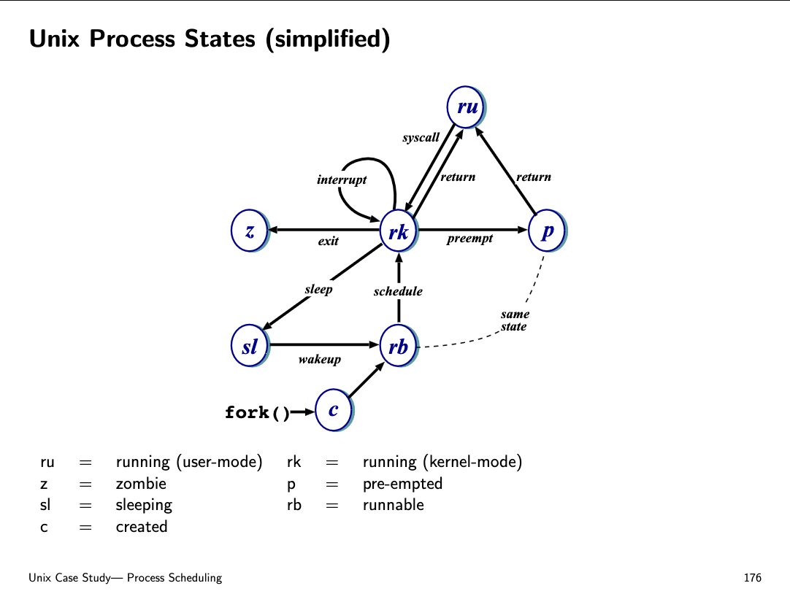
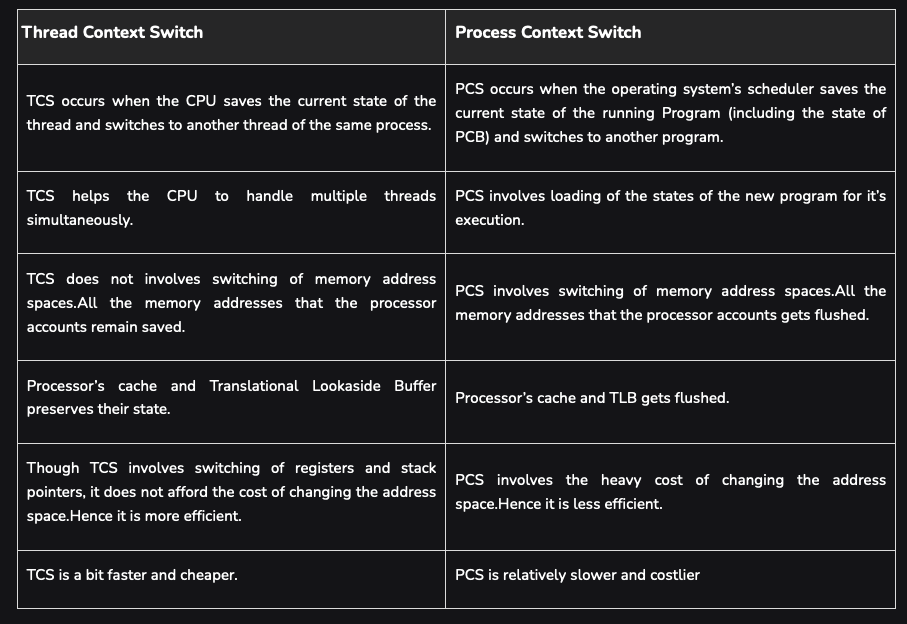

## Blocking vs Non-Blocking System Call

### Blocking IO
A blocking system call is one that must wait until the action can be completed.

involves transitioning task (eg thread) to waiting state (thread.sleep -> to yield control to other threads to run) to wait for IO to return. meanwhile thread cannot run other tasks.

> similarly in the coroutine world, if coroutine needs to be awaited (coroutine.sleep -> to yield to other coroutines to run) ie suspended to wait for io operation to return then it's blocking.

> BUT for coroutines since it's using cooperative scheduling not preempted, it's up to developer to write the program st it will yield control back to the main event loop IF the operation performed is blocking
-- eg in python when making a blocking network call, developer may use yield / coroutine.sleep to tell the python interpreter to return control back to the main event loop and resume this coroutine whenever python interpreter is able to.

For instance, read() is blocking:

1. If no input is ready, the calling process will be suspended
2. yield() the remaining quanta, and schedule other processes first
3. It will only resume execution after some input is ready. Depending on the scheduler implementation it may either:
    - 3.1. Be scheduled again and retry (e.g: round robin)
        - 3.1.1. The process re-executes read() and may yield() again if there’s no input.
        - 3.1.2. Repeat until successful.
    - 3.2. Not scheduled, use some wait flag/status to tell the scheduler to not schedule this again unless some input is received
wait flag/status cleared by interrupt handler (more info in the next topic)

### Non-blocking IO
a non blocking system call can return almost immediately without waiting for the I/O to complete.

For instance, select() is non-blocking.

since io operation returns almost immediately, need to use polling to check on the progress of the operation eg how many bytes have been read if we're reading the whole file. 

The select() system call can be used to check if there is new data or not, e.g: at stdin file descriptor.
Then a blocking system call like read() may be used afterwards knowing that they will complete immediately.

## System Call

**Implementation**

System calls are interfaces through which user applications interact with the operating system’s kernel to perform tasks that require higher privileges, such as I/O operations, process management, and file manipulations.

System calls are implemented as part of the operating system kernel. When a user program invokes a system call, it executes a software interrupt or a special instruction that switches the processor from user mode to kernel mode. This transition is necessary because system calls often require accessing resources that are protected and can only be safely manipulated by the kernel.

**System Call Number:**

Each system call is associated with a unique identifier known as a system call number. This number is used to index into a system call table maintained by the kernel, which maps numbers to the corresponding system call handlers. When a system call is invoked, the kernel uses this number to find the appropriate function to execute.

**How syscalls are executed**

1. The trap handler first saves the states of the process8 and examines the system call index left in a certain register.
2. It then refers to the standard system call table and dispatches the system service request accordingly, i.e: branches onto the address in the Kernel space that implements the system call service routine of the system call with that index and executes it.
3. When the system call service routine returns to the trap handler, the program execution can be resumed. If the system call does not return yet (e.g: block system call like input()), then the scheduler may be called to schedule another process, while this process is put to wait until the requested service is available.

as each syscall requires cpying process stack and trapping to switch from usermode to kernel mode to run the syscall handler (eg read bytes from file) in the CPU, this is expensive since it halts the existing process execution state and if syscall is blocking then process may need to transition to waiting state.

[linux syscall api doc](https://man7.org/linux/man-pages/man2/syscalls.2.html)

## OS Types (Monolithic vs microkernel vs hybrid)

### Monolithic (Dual / no dual mode)

**Dual mode = user mode + kernel mode**

The kernel provides file system management, CPU scheduling, memory management, and other operating-system functions through system calls. That is an enormous amount of functionality to be combined into one level.

Pros: distinct performance advantage because there is very little overhead in the system call interface or in communication within the kernel (compared to microkernel).

**W/o dual mode** - means user programs can access priveleged device drivers + basic IO routines to write directly to disk (ie no arbitration by kernel). Dangerous as programs can crash the system but performant since no syscalls.

### Microkernel

structures the operating system by removing all nonessential components from the kernel and implementing them as system and user-level programs. The result is a smaller kernel that does only tasks pertaining to:

1. Inter-Process Communication,
2. Memory Management,
3. Scheduling

For instance, if a user program wishes to access a file, it must interact with the file server.

- The client program and service never interact directly.
- Rather, they communicate indirectly by exchanging messages with the microkernel via the syscall interface.

Cons: suffer in performance increased system-function overhead due to frequent requirement in performing context switch (compared to monolith).

### Virtualization

OS Virtualization refers to the creation of a virtual environment where an operating system can run on top of another through the use of software. This allows multiple operating systems to run on a single physical machine, each isolated from the others, enabling efficient resource utilization and flexibility in deploying different software or operating system environments.

### Hypervisor
A Hypervisor is the software that makes OS virtualization possible. It sits between the hardware and the operating systems and manages the distribution of hardware resources to the various virtual environments (often called virtual machines or VMs). There are two main types of hypervisors:

- Type 1 Hypervisors: Also known as bare-metal hypervisors, these run directly on the host’s hardware to control the hardware and to manage guest operating systems. For example, VMware ESXi, Microsoft Hyper-V, and Xen are Type 1 hypervisors.
- Type 2 Hypervisors: Also known as hosted hypervisors, these run on a conventional operating system just as other computer programs do. The host operating system provides device support and manages the physical hardware. Examples include VMware Workstation and Oracle VirtualBox.

Both types of hypervisors help in providing the virtualization capabilities that allow multiple OS instances to run simultaneously on the same machine, each thinking it has its own set of hardware resources.

### Java OS

Java does not have its own scheduler for processes. Instead, it relies on the underlying OS kernel for basic process and thread management.

**Threads and Processes:**
- Java does not manage processes directly in the same way as an operating system. Instead, Java applications typically run as a single process within the JVM.
- Within this process, Java can manage multiple threads. Threads in Java are managed by the JVM and can be either user threads or daemon threads.

**Java Threads:**
- Java provides a robust threading model that allows for concurrent execution of code. This is done using the java.lang.Thread class and the java.util.concurrent package.
- Java threads are **mapped to native operating system threads**. This means that the **underlying OS is responsible for scheduling and executing these threads.**

**JVM and the OS Kernel:**
- The JVM relies on the underlying OS kernel for fundamental process and thread management tasks. This includes scheduling, context switching, and inter-process communication.
- When you create and manage threads in a Java application, the JVM interfaces with the OS to handle these threads. The OS kernel’s scheduler is responsible for allocating CPU time to each thread based on its scheduling algorithm (e.g., round-robin, priority-based).

**Java’s Concurrency Utilities:**
- Java provides a high-level API for managing concurrency through the java.util.concurrent package. This includes classes like ExecutorService, Future, and Semaphore that facilitate advanced thread management and synchronization.
- These utilities abstract away many of the complexities of thread management and synchronization, allowing developers to focus on higher-level concurrency tasks.

**Garbage Collection:**
- Another aspect of process management in Java is garbage collection. The JVM includes garbage collectors that automatically reclaim memory occupied by objects that are no longer in use.
- Garbage collection runs in its own threads and can impact the performance of a Java application. The JVM provides various garbage collection algorithms (e.g., Serial, Parallel, G1) that can be tuned based on the application’s requirements.
    
**Process Management:**
- While Java itself doesn’t manage OS-level processes, it can interact with them using the java.lang.Process and java.lang.ProcessBuilder classes. These classes allow Java applications to start and manage external processes.
- Through these classes, a Java application can execute system commands, read and write to the standard input/output streams of the processes, and wait for them to complete.

## What is in a Process

A process is a program in execution. I.e. a program becomes a process when it is loaded into memory and scheduled to run by the CPU.

A single process includes all of the following information (a.k.a. process state).

Each process has its own file descriptor table meaning that fds are unique per process.

1. The text section (code or instructions)
2. Value of the Program Counter (PC)
3. Contents of the processor’s registers
4. Dedicated address space (block of location) in memory
5. Stack (temporary data such as function parameters, return address, and local variables, grows downwards),
6. Data (allocated memory during compile time such as global and static variables that have predefined values)
7. Heap (dynamically allocated memory – typically by calling malloc in C – during process runtime, grows upwards)

**Protection**: Each process runs in a different address space and sees itself as running in a virtual machine – unaware of the presence of other processes in the machine (virtual memory). Multiple processes execution in a single machine is concurrent, managed by the kernel scheduler.

**Concurrency**: Multiple processes being in progress at the same time, sharing system resources. These processes can run in parallel on multiple processors or cores, or they can be interleaved on a single processor through time slicing.

## Process States

- New: The process is being created.
- Running: Instructions are being executed.
- Waiting: The process is waiting for some event to occur (such as an I/O completion or reception of a signal).
- Ready: The process is waiting to be assigned to a processor
- Terminated: The process has finished execution.

## System-wide Process Table (ctx switching + scheduling) & Process Control Block (process metadata)

**System-wide process table**
Data structure maintained by the Kernel to facilitate context switching and scheduling. A process table is made up of an array of PCBs, containing information about of current processes in the system.

**Process Control Block (PCB)**
Each process metadata is stored by the Kernel in a particular data structure called the process control block (PCB). 

The PCB contains many pieces of information associated with a specific process. These information are updated each time when a process is interrupted:

1. Process state: any of the state of the process – new, ready, running, waiting, terminated
2. Program counter: the address of the next instruction for this process
3. CPU registers: the contents of the registers in the CPU when an interrupt occurs, including stack pointer, exception pointer, stack base, linkage pointer, etc. These contents are saved each time to allow the process to be continued correctly afterward.
4. Scheduling information: access priority, pointers to scheduling queues, and any other scheduling parameters
5. Memory-management information: page tables, MMU-related information, memory limits
6. Accounting information: amount of CPU and real time used, time limits, account numbers, process id (pid)
7. I/O status information: the list of I/O devices allocated to the process, a list of open files

PCB is represented in C as a `task_struct`.

Within the Linux kernel, all active processes are represented using a doubly linked list of `task_struct`. The kernel maintains a current_pointer to the process that’s currently running in the CPU.

## Context Switching

**Definition:** mechanism of saving the states of the current process and restoring (loading) the state of a different process when switching the CPU to execute another process.

When a CPU switches execution between one process to another, the Kernel has to store all of the process states onto its corresponding PCB, and load the new process’ information from its PCB before resuming them. 

Context switching may happen preemptively by the scheduler / if process needs to wait on IO and can be swapped out for a schedulable process.

**Benefits of Context Switching:**
- Gives illusion of concurrency in uniprocessor system by improving system responsiveness and intractability
- To support multiprogramming, we need to optimise CPU usage. We cannot just let one single program to run all the time, especially when that program blocks execution when waiting for I/O (idles, have nothing important to do).

**Drawback of Context Switching:**
Context-switch time is pure overhead, because the system does no useful work while switching. To minimise downtime due to overhead, context-switch times are highly dependent on hardware support – some hardware supports rapid context switching by having a dedicated unit for that (effectively bypassing the CPU).

## Mode Switch Versus Context Switch

Mode switch and Context switch – although similar in name; they are two separate concepts.

### Mode switch

- The privilege of a process changes
- Simply escalates privilege from user mode to kernel mode to access kernel services.
- Done by either: hardware interrupts, system calls (traps, software interrupt), exception, or reset
- Mode switch may not always lead to context switch. Depending on implementation, Kernel code decides whether or not it is necessary.

**When does mode switch happen**
A user process undergoes a mode switch when it needs access to system resources. This is implemented through the system call interface or by interrupts such as page faults.

There are two modes:
- User mode
- Kernel mode

Processor time spent in user mode (application and shared libraries) is reflected as user time in the output of commands such as the vmstat, iostat, and sar commands. Processor time spent in kernel mode is reflected as system time in the output of these commands.

### Context switch

- Requires both saving (all) states of the old process and loading (all) states of the new process to resume execution
- Can be caused either by timed interrupt or system call that leads to a yield(), e.g: when waiting for something.

**When does context switching occur**
The scheduler performs a context switch when any of the following occurs:
- A thread must wait for a resource (voluntarily), such as disk I/O, network I/O, sleep, or locks
- A higher priority thread wakes up (involuntarily)
- The thread has used up its time slice (usually 10 ms).

Context switch time, system calls, device interrupts, NFS I/O, and any other activity in the kernel is considered as system time.

A context switch most of the time implies a mode switch, since it is the kernel that switches execution from one process to another. A context switch involves restoring the state of the process that will resume execution, including memory mappings, registers, etc., and all this can only be done in kernel mode.

**Types of context switch (Process vs Thread)**

For Process Ctx switch, TLB is cleared since memory pages in processes are different but those in threads of the same processes are same.

**1. Thread Context Switch**
Switch from one thread to another to be run. The computer CPU stores the state of current thread, so that it can be retured later. Next it switches to the next thread, picks it where it was left before, and continuous to start working.

**1.1. Characteristics of Thread Context Switch**
- As the threads share the same memory space, the switching of the threads is faster as less information needs to be saved and restored.
- There is no need to change the memory maps during the switching, as the threads share data and resources like memory.
- The CPU only needs to switch the thread’s state such as the program counter and the registers

Thread switching is quicker than the switching between the processes because the threads within the same process share the memory and resources.

**2. Process Context Switch**

**2.1 Characteristics of Process Context Switch**
- Switching of the processes take longer time, Since the entire memory space , the resources and the environment of one process needs to be saved and the new process’s information must be loaded.
- The operating system must switch between different memory spaces as each process has its own memory.
- Process Context Switching is heavier, as it involves all the context details , such as CPU registers, process states and the memory maps

## Process Scheduling Queues

There are three queues that are maintained by the process scheduler:
1. Job queue – set of all processes in the system (can be in both main memory and swap space of disk)
2. Ready queue – set of all processes residing in main memory, ready and waiting to execute (queueing for CPU)
3. Device queues – set of processes waiting for an I/O device (one queue for each device)

## Child vs Parent Process

The new child process consists of the entire copy of the address space (code, stack, process of execution, etc) of the original parent process at the point of fork().

The child process inherits the parent process’ state at the point of fork().

Parent and child processes operate in different address space (isolation). Since they are different processes, parent and children processes execute concurrently.

Practically, a parent process waits for its children to terminate (using wait() system call) to read the child process’ exit status and only then its PCB entry in the process table can be removed.

Child processes is unable wait for their parents to terminate (there’s no system call for that in UNIX systems). Since children processes are a duplicate of their parents (inherits the whole address space), they can either
- Execute the same instructions as their parents concurrently, or
- Load a new program into its address space

