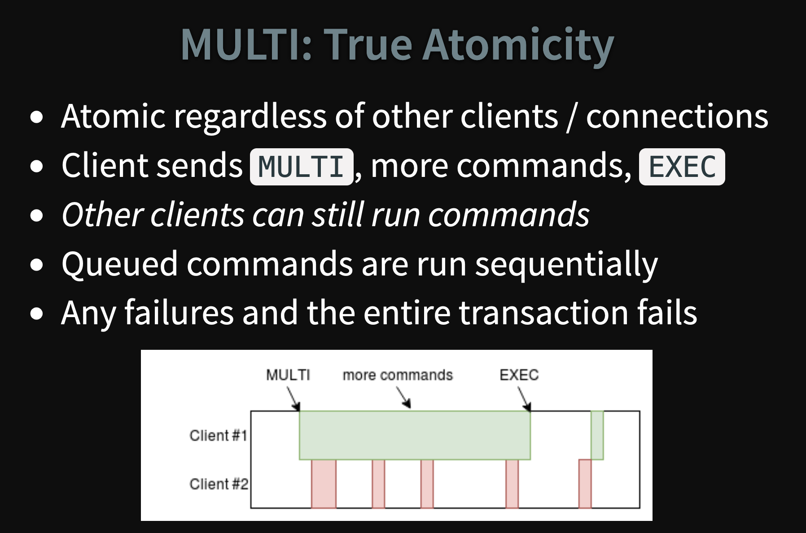

## Rate Limiting

- https://arpitbhayani.me/blogs/sliding-window-ratelimiter
- https://www.figma.com/blog/an-alternative-approach-to-rate-limiting/

Finding a way to accurately controlling web traffic & minimizing memory usage — was a challenge. These following rate limiting algorithms were considered:
1. Token bucket (countdown to 0; not very accurate since counter is reset every start of time window; redis operation of read then write not atomic, could lead to race conditions)
2. Fixed window counters (counts up from 0 to limit; similar to token bucket not very accurate since counter is reset every start of time window; atomic so no need to deal with locking;)
3. Sliding window log (store a sorted set of unix timestamps for each request coming in; high memory usage since memory usage directly proportional to number of requests; accurate since no counter 'reset')
4. Hybrid (fixed window counter + sliding window) (use smaller granularity time buckets compared to configured rate limit st we only allow max (rate limit window - time bucket granularity) requests to bypass limiter check)

A Redis server will execute commands (or transactions, or scripts) atomically since Redis is single-threaded. But a sequence of redis operations involving multiple processes are not guaranteed to be atomic (if they're not wrapped in a single txn).



**Pseudo code**

```/bin/python
def is_allowed(user_id:str) -> bool:
    # epoch seconds
    current_time = int(time.time())

    # Fetch the configuration for the given key
    # the configuration holds the number of requests allowed in the time window and the time granularity configured.
    # num_reqs_allowed : int e.g. 5
    # time_granularity_secs : int e.g. h=3600s, m=60s, s=1s
    num_reqs_allowed, time_granularity_secs = get_ratelimit_config(key)

    # gets the time granularity 1/60th the size of the configured rate limit time granularity
    # e.g. if rate limit time granularity = h --> time granularity returned = m --> 60s
    scaled_time_granularity_secs = time_granularity_secs // 60

    # calculate number of requests made since rate limit time window ago
    # e.g. if time granularity is h, this sums the number of requests made from current_time-1h..current_time
    start_time = (current_time // time_granularity_secs) * time_granularity_secs
    num_requests_made = get_requests_made_since(user_id, start_time, current_time, scaled_time_granularity_secs)
    if num_requests_made > num_reqs_allowed:
        return False
    
    # Since the request goes through, register it with smaller time granularity key
    # e.g. if time granularity is h, this increments the counter for the prev min
    scaled_start_time = current_time - scaled_time_granularity_secs
    increment_counter_for_time_window(user_id, scaled_start_time)

    return True

def increment_counter_for_time_window(user_id:str, epoch_secs:int):
    # use pipelining to batch redis operations together
    with self.redis.pipeline() as pipe:
        num_reqs_in_bucket = pipe.hget(user_id, epoch_secs) or 0

        # run set, expire in the same txn
        # key: user_id
        # val: {epoch_secs: num_of_reqs, epoch_secs_1:num_of_reqs_1...}
        pipe
            .multi()
            .hset(user_id, {epoch_secs: num_reqs_in_bucket+1})
            .hexpire(user_id, epoch_secs+EXPIRY_TIME_SECS, epoch_secs)
            .execute()

def get_requests_made_since(user_id:str, start_time:int, current_time:int, time_granularity_secs:int):
    # get keys between start_time..current_time incrementing every time_granularity_secs
    epoch_secs_keys = [ts for ts in range(start_time, (1+(current_time//time_granularity_secs))*time_granularity_secs, time_granularity_secs) if ts]

    # use pipelining to batch redis operations together
    with self.redis.pipeline() as pipe:
        nums_reqs_in_time_buckets = pipe.hmget(user_id, *epoch_secs_keys)
        return sum(nums_reqs_in_time_buckets)
    return 0

```

#### 1. Token Bucket
Whenever a new request arrives from a user, the rate limiter would have to do a number of things to track usage. It would fetch the hash (containing the number of tokens left, unix ts for that time bucket interval) from Redis and refill the available tokens based on a chosen refill rate and the time of the user’s last request. Then, it would update the hash with the current request’s timestamp and the new available token count. When the available token count drops to zero, the rate limiter knows the user has exceeded the limit.
If User 1’s token bucket empties faster than it refills and no tokens are left, User 1 has exceeded the rate limit.


Despite the token bucket algorithm’s elegance and tiny memory footprint, its Redis operations aren’t atomic. In a distributed environment, the “read-and-then-write” behavior creates a race condition, which means the rate limiter can at times be too lenient.
If only a single token remains and two servers’ Redis operations interleave, both requests would be let through.


Imagine if there was only one available token for a user and that user issued multiple requests. If two separate processes served each of these requests and concurrently read the available token count before either of them updated it, each process would think the user had a single token left and that they had not hit the rate limit.

Our token bucket implementation could achieve atomicity if each process were to fetch a Redis lock for the duration of its Redis operations. This, however, would come at the expense of slowing down concurrent requests from the same user and introducing another layer of complexity. Alternatively, we could make the token bucket’s Redis operations atomic via Lua scripting. For simplicity, however, I decided to avoid the unnecessary complications of adding another language to our codebase.


#### 2. Fixed window counters

As a second approach, I considered fixed window counters. It’s a simple, memory-efficient algorithm that records the number of requests from a sender occurring in the rate limit’s time interval. Unlike the token bucket algorithm, this approach’s Redis operations are atomic. Each request would increment a Redis key that included the request’s timestamp. A given Redis key might look like this:
User 1 has made 1 request between 10:00:00 AM GMT and 10:00:59 GMT on Thursday, March 30, 2017.

When incrementing the request count for a given timestamp, we would compare its value to our rate limit to decide whether to reject the request. We would also tell Redis to expire the key when the current minute passed to ensure that stale counters didn’t stick around forever.
When the value of the latest Redis key exceeds the request threshold, User 1 has exceeded the rate limit.


Although the fixed window approach offers a straightforward mental model, it can sometimes let through twice the number of allowed requests per minute. For example, if our rate limit were 5 requests per minute and a user made 5 requests at 11:00:59, they could make 5 more requests at 11:01:00 because a new counter begins at the start of each minute. Despite a rate limit of 5 requests per minute, we’ve now allowed 10 requests in less than one minute!
If we count requests in fixed minute windows, we could let through up to twice the number of allowed requests per minute.


We could avoid this issue by adding another rate limit with a smaller threshold and shorter enforcement window — e.g. 2 requests per second in addition to 5 requests per minute — but this would overcomplicate the rate limit. Arguably, it would also impose too severe of a restriction on how often the user could make requests.


#### 3. Sliding window log

The final rate limiter implementation I considered optimizes for accuracy — it just stores a timestamp for each request. As Peter Hayes describes, we could efficiently track all of a user’s requests in a single sorted set.
User 1’s three requests on Thursday, March 30, 2017 at 10:00:00, 10:00:54, and 10:01:38 GMT are sorted by Unix microsecond timestamp.

When the web application processes a request, it would insert a new member into the sorted set with a sort value of the Unix microsecond timestamp. This would allow us to efficiently remove all of the set’s members with outdated timestamps and count the size of the set afterward. The sorted set’s size would then be equal to the number of requests in the most recent sliding window of time.
When the size of User 1’s sorted set exceeds the request threshold, User 1 has exceeded the rate limit.


Both this algorithm and the fixed window counters approach share an atomic “write-and-then-read” Redis operation sequence, but the former produces a notable side effect. Namely, the rate limiter continues to count requests even after the user exceeds the rate limit. I was comfortable with this behavior, as it would just extend a ban on a malicious user rather than letting their requests through as soon as the window of time had passed.

While the precision of the sliding window log approach may be useful for a developer API, it leaves a considerably large memory footprint because it stores a value for every request. This wasn’t ideal for Figma. A single rate limit of 500 requests per day per user on a website with 10,000 active users per day could hypothetically mean storing 5,000,000 values in Redis. If each stored timestamp value in Redis were even a 4-byte integer, this would take ~20 MB (4 bytes per timestamp * 10,000 users * 500 requests/user = 20,000,000 bytes).


#### 4. (Hybrid) Sliding window counters

Ultimately, the last two rate limiter approaches — fixed window counters and sliding window log — inspired the algorithm that stopped the spammers. We count requests from each sender using multiple fixed time windows 1/60th the size of our rate limit’s time window.

For example, if we have an hourly rate limit, we increment counters specific to the current Unix minute timestamp and calculate the sum of all counters in the past hour when we receive a new request. To reduce our memory footprint, we store our counters in a Redis hash — they offer extremely efficient storage when they have fewer than 100 keys. When each request increments a counter in the hash, it also sets the hash to expire an hour later. In the event that a user makes requests every minute, the user’s hash can grow large from holding onto counters for bygone timestamps. We prevent this by regularly removing these counters when there are a considerable number of them.
When the sum of the counters with timestamps in the past hour exceeds the request threshold, User 1 has exceeded the rate limit.


Let’s compare the memory usage of this algorithm with our calculation from the sliding window log algorithm. If we have a rate limit of 500 requests per day per user on a website with 10,000 active users, we would at most need to store ~600,000 values in Redis. That comes out to a memory footprint of ~2.4 MB (4 bytes per counter * 60 counters * 10,000 users = 2,400,000 bytes). This is a bit more scalable.
Practical considerations

Using fixed window counters with a 1:60 ratio between the counter’s time window and the rate limit’s enforcement time window, our rate limiter was accurate down to the second and significantly minimized memory usage. In practice, however, a large enforcement time window — e.g. one hour — slightly reduced the precision of the rate limiter. This is best illustrated through an example: For an hourly rate limit, when the rate limiter checks usage at 11:00:35, it ignores the requests that occurred between 10:00:00 and 10:00:59.
If we count requests in 60 fixed minute windows and check the number of requests when we’re within a fixed minute window, we may undercount the total number of requests in the last hour. Above, the rate limiter ignores the three requests that occurred between 10:00:00 and 10:00:59.

This slight degree of variable leniency — up to 59 seconds — may be acceptable depending on your use case. In our situation, however, we preferred for our rate limiter to sometimes be a tad harsher instead of slightly lenient, so I calculated the sum of all counters in the last hour and one minute whenever the current timestamp wasn’t divisible by 60. Variable restrictiveness could even be useful in discouraging programmatic scripting against the site.

Finally, we had to reflect on how to respond to users who exceeded the rate limit. Traditionally, web applications respond to requests from users who surpass the rate limit with a HTTP response code of 429. Our rate limiter initially did so as well. But in the case of Figma’s spam attack, our attackers saw the response code change from 200 to 429 and simply created new accounts to circumvent the rate limiting on their blocked accounts. In response, we implemented a shadow ban: On the surface, the attackers continued to receive a 200 HTTP response code, but behind the scenes we simply stopped sending document invitations after they exceeded the rate limit.

#### Potential issues and performance bottlenecks

**1. Atomic updates**

While we register a request in the Request Store we increment the request counter by 1. When the code runs in a multi-threaded environment, all the threads executing the function for the same key key, all will try to increment the same counter. Thus there will be a classical problem where multiple writers read the same old value and updates. To fix this we need to ensure that the increment is done atomically and to do this we could use one of the following approaches
1. optimistic locking (compare and swap)
2. pessimistic locks (always taking lock before incrementing)
3. utilize atomic hardware instructions (fetch-and-add instruction)

**2. Data structures**
- use a data structure that is optimized for range sum, like segment tree
- use a running aggregation algorithm that would prevent from recomputing redundant sums

#### Locking
**1.1 Optimistic Locking**
Optimistic Locking is a strategy where you read a record, take note of a version number (other methods to do this involve dates, timestamps or checksums/hashes) and check that the version hasn't changed before you write the record back. When you write the record back you filter the update on the version to make sure it's atomic. (i.e. hasn't been updated between when you check the version and write the record to the disk) and update the version in one hit.

If the record is dirty (i.e. different version to yours) you abort the transaction and the user can re-start it.
similar to how Elasticsearch does doc updates.

This strategy is most applicable to high-volume systems and three-tier architectures where you do not necessarily maintain a connection to the database for your session. In this situation the client cannot actually maintain database locks as the connections are taken from a pool and you may not be using the same connection from one access to the next.

**1.2. Pessimistic Locking**
Pessimistic Locking is when you lock the record for your exclusive use (e.g. using row / table locks) until you have finished with it. It has much better integrity than optimistic locking but requires you to be careful with your application design to avoid Deadlocks.

**Mutexes vs Spin Locks**

There are two different ways of waiting:
- Spin locks (Polling) are suitable for locks that are held only for very short times. It allows the waiting thread to keep its processor, repeatedly checking the lock bit in a tight loop (spin) until the lock becomes free. Spinning results in increased CPU time (system time for kernel or kernel extension locks).
- Sleeping locks (Mutexes/Semaphores) are suitable for locks that may be held for longer periods. The thread sleeps until the lock is free and is put back in the run queue when the lock becomes free. Sleeping results in more idle time.

Waiting always decreases system performance. If a spin lock is used, the processor is busy, but it is not doing useful work (not contributing to throughput). If a sleeping lock is used, the overhead of context switching and dispatching as well as the consequent increase in cache misses is incurred.

**Standalone vs Distributed Locks**


We can abstract the concept of distributed locks. A distributed lock must be a resource that can provide concurrent control and output an exclusive state:
`Lock = Resource + Concurrency Control + Ownership Display`

Take a common standalone lock as an example:
```
Spinlock = BOOL + CAS (Optimistic Lock)
Mutex = BOOL + CAS + notification (Pessimistic Lock)
```

In a standalone environment, the kernel has a "God's eye" and can know if a process is alive. When a process fails, the kernel can release the lock resources held by the process. However, this becomes a challenge in a distributed environment. We need to provide locks with a new feature to cope with various machine failures or crashes: availability.

Any service that provides the three features can provide the capabilities of distributed locks. The resource can be a file or a key-value (KV) pair, which is operated through atomic operations, such as a file or KV creation, indicates the ownership through the successful creation result, and ensures the availability of the lock through TTL or session.


**Types of Distributed Locks**
Distributed locks are divided into the following types based on the security of lock resources:
- Distributed systems based on asynchronous replication, such as MySQL, Tair, and Redis
- Paxos-based distributed consensus systems, such as ZooKeeper, etcd, and Consul

A distributed system based on asynchronous replication faces the risk of data loss (lock loss) and is not secure enough. Such a system often provides fine-grained lock services through the TTL mechanism. It applies to time-sensitive services, need to set a short validity period, have short-term tasks, and are subject to relatively limited impact on the business if the loss of locks occurs.

A distributed system based on the Paxos protocol ensures multiple copies of data through the consensus protocol and has high data security. It often uses the lease (session) mechanism to provide coarse-granularity lock services. This system has certain usage requirements and applies to services that are sensitive to security, need to hold locks for a long time, and cannot afford the loss of locks.

